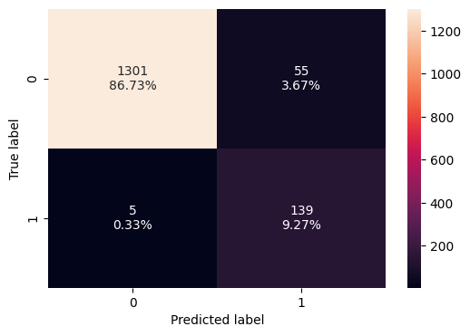

# Machine Learning: AllLife Bank Personal Loan Campaign

## Problem Statement

### Context

AllLife Bank is a US bank that has a growing customer base. The majority of these customers are liability customers (depositors) with varying sizes of deposits. The number of customers who are also borrowers (asset customers) is quite small, and the bank is interested in expanding this base rapidly to bring in more loan business and in the process, earn more through the interest on loans. In particular, the management wants to explore ways of converting its liability customers to personal loan customers (while retaining them as depositors).

A campaign that the bank ran last year for liability customers showed a healthy conversion rate of over 9% success. This has encouraged the retail marketing department to devise campaigns with better target marketing to increase the success ratio.

You as a Data scientist at AllLife bank have to build a model that will help the marketing department to identify the potential customers who have a higher probability of purchasing the loan.

### Objective

To predict whether a liability customer will buy personal loans, to understand which customer attributes are most significant in driving purchases, and identify which segment of customers to target more.

### Data Dictionary
* `ID`: Customer ID
* `Age`: Customer’s age in completed years
* `Experience`: #years of professional experience
* `Income`: Annual income of the customer (in thousand dollars)
* `ZIP Code`: Home Address ZIP code.
* `Family`: the Family size of the customer
* `CCAvg`: Average spending on credit cards per month (in thousand dollars)
* `Education`: Education Level. 1: Undergrad; 2: Graduate;3: Advanced/Professional
* `Mortgage`: Value of house mortgage if any. (in thousand dollars)
* `Personal_Loan`: Did this customer accept the personal loan offered in the last campaign? (0: No, 1: Yes)
* `Securities_Account`: Does the customer have securities account with the bank? (0: No, 1: Yes)
* `CD_Account`: Does the customer have a certificate of deposit (CD) account with the bank? (0: No, 1: Yes)
* `Online`: Do customers use internet banking facilities? (0: No, 1: Yes)
* `CreditCard`: Does the customer use a credit card issued by any other Bank (excluding All life Bank)? (0: No, 1: Yes)

## Importing necessary libraries


```python
# this will help in making the Python code more structured automatically (good coding practice)
# %load_ext nb_black

import warnings

warnings.filterwarnings("ignore")

# Libraries to help with reading and manipulating data

import pandas as pd
import numpy as np

# Library to split data
from sklearn.model_selection import train_test_split

# libaries to help with data visualization
import matplotlib.pyplot as plt
import seaborn as sns

# Removes the limit for the number of displayed columns
pd.set_option("display.max_columns", None)
# Sets the limit for the number of displayed rows
pd.set_option("display.max_rows", 200)


# To build model for prediction

from sklearn.linear_model import LogisticRegression
from sklearn.tree import DecisionTreeClassifier
from sklearn import tree

# To tune different models
from sklearn.model_selection import GridSearchCV

# To get diferent metric scores


from sklearn.metrics import (
    f1_score,
    accuracy_score,
    recall_score,
    precision_score,
    confusion_matrix,
    roc_auc_score,
    ConfusionMatrixDisplay,
    precision_recall_curve,
    roc_curve,
    make_scorer,
)
```

## Loading the dataset


```python
#Loading the dataset
Loan = pd.read_csv("./Loan_Modelling.csv")
```

## Data Overview

* Observations
* Sanity checks


```python
loan_data = Loan.copy()
```

### View the first and last 5 rows of the dataset.


```python
#View the first 5 rows of the dataset
loan_data.head(5)
```


<div>
<style scoped>
    .dataframe tbody tr th:only-of-type {
        vertical-align: middle;
    }

    .dataframe tbody tr th {
        vertical-align: top;
    }

    .dataframe thead th {
        text-align: right;
    }
</style>
<table border="1" class="dataframe">
  <thead>
    <tr style="text-align: right;">
      <th></th>
      <th>ID</th>
      <th>Age</th>
      <th>Experience</th>
      <th>Income</th>
      <th>ZIPCode</th>
      <th>Family</th>
      <th>CCAvg</th>
      <th>Education</th>
      <th>Mortgage</th>
      <th>Personal_Loan</th>
      <th>Securities_Account</th>
      <th>CD_Account</th>
      <th>Online</th>
      <th>CreditCard</th>
    </tr>
  </thead>
  <tbody>
    <tr>
      <th>0</th>
      <td>1</td>
      <td>25</td>
      <td>1</td>
      <td>49</td>
      <td>91107</td>
      <td>4</td>
      <td>1.6</td>
      <td>1</td>
      <td>0</td>
      <td>0</td>
      <td>1</td>
      <td>0</td>
      <td>0</td>
      <td>0</td>
    </tr>
    <tr>
      <th>1</th>
      <td>2</td>
      <td>45</td>
      <td>19</td>
      <td>34</td>
      <td>90089</td>
      <td>3</td>
      <td>1.5</td>
      <td>1</td>
      <td>0</td>
      <td>0</td>
      <td>1</td>
      <td>0</td>
      <td>0</td>
      <td>0</td>
    </tr>
    <tr>
      <th>2</th>
      <td>3</td>
      <td>39</td>
      <td>15</td>
      <td>11</td>
      <td>94720</td>
      <td>1</td>
      <td>1.0</td>
      <td>1</td>
      <td>0</td>
      <td>0</td>
      <td>0</td>
      <td>0</td>
      <td>0</td>
      <td>0</td>
    </tr>
    <tr>
      <th>3</th>
      <td>4</td>
      <td>35</td>
      <td>9</td>
      <td>100</td>
      <td>94112</td>
      <td>1</td>
      <td>2.7</td>
      <td>2</td>
      <td>0</td>
      <td>0</td>
      <td>0</td>
      <td>0</td>
      <td>0</td>
      <td>0</td>
    </tr>
    <tr>
      <th>4</th>
      <td>5</td>
      <td>35</td>
      <td>8</td>
      <td>45</td>
      <td>91330</td>
      <td>4</td>
      <td>1.0</td>
      <td>2</td>
      <td>0</td>
      <td>0</td>
      <td>0</td>
      <td>0</td>
      <td>0</td>
      <td>1</td>
    </tr>
  </tbody>
</table>
</div>


```python
#view the last 5 rows of the dataset
loan_data.tail(5)
```


<div>
<style scoped>
    .dataframe tbody tr th:only-of-type {
        vertical-align: middle;
    }

    .dataframe tbody tr th {
        vertical-align: top;
    }

    .dataframe thead th {
        text-align: right;
    }
</style>
<table border="1" class="dataframe">
  <thead>
    <tr style="text-align: right;">
      <th></th>
      <th>ID</th>
      <th>Age</th>
      <th>Experience</th>
      <th>Income</th>
      <th>ZIPCode</th>
      <th>Family</th>
      <th>CCAvg</th>
      <th>Education</th>
      <th>Mortgage</th>
      <th>Personal_Loan</th>
      <th>Securities_Account</th>
      <th>CD_Account</th>
      <th>Online</th>
      <th>CreditCard</th>
    </tr>
  </thead>
  <tbody>
    <tr>
      <th>4995</th>
      <td>4996</td>
      <td>29</td>
      <td>3</td>
      <td>40</td>
      <td>92697</td>
      <td>1</td>
      <td>1.9</td>
      <td>3</td>
      <td>0</td>
      <td>0</td>
      <td>0</td>
      <td>0</td>
      <td>1</td>
      <td>0</td>
    </tr>
    <tr>
      <th>4996</th>
      <td>4997</td>
      <td>30</td>
      <td>4</td>
      <td>15</td>
      <td>92037</td>
      <td>4</td>
      <td>0.4</td>
      <td>1</td>
      <td>85</td>
      <td>0</td>
      <td>0</td>
      <td>0</td>
      <td>1</td>
      <td>0</td>
    </tr>
    <tr>
      <th>4997</th>
      <td>4998</td>
      <td>63</td>
      <td>39</td>
      <td>24</td>
      <td>93023</td>
      <td>2</td>
      <td>0.3</td>
      <td>3</td>
      <td>0</td>
      <td>0</td>
      <td>0</td>
      <td>0</td>
      <td>0</td>
      <td>0</td>
    </tr>
    <tr>
      <th>4998</th>
      <td>4999</td>
      <td>65</td>
      <td>40</td>
      <td>49</td>
      <td>90034</td>
      <td>3</td>
      <td>0.5</td>
      <td>2</td>
      <td>0</td>
      <td>0</td>
      <td>0</td>
      <td>0</td>
      <td>1</td>
      <td>0</td>
    </tr>
    <tr>
      <th>4999</th>
      <td>5000</td>
      <td>28</td>
      <td>4</td>
      <td>83</td>
      <td>92612</td>
      <td>3</td>
      <td>0.8</td>
      <td>1</td>
      <td>0</td>
      <td>0</td>
      <td>0</td>
      <td>0</td>
      <td>1</td>
      <td>1</td>
    </tr>
  </tbody>
</table>
</div>


### Understand the shape of the dataset.


```python
#shape of the dataset
loan_data.shape
```


    (5000, 14)


#### Observations on Dataset

* The dataset contains 10000 rows and 11 columns.
* The dataset contains 11 columns.

### Check the data types of the columns for the dataset


```python
#Check the data types of the columns for the dataset
loan_data.dtypes
```


    ID                      int64
    Age                     int64
    Experience              int64
    Income                  int64
    ZIPCode                 int64
    Family                  int64
    CCAvg                 float64
    Education               int64
    Mortgage                int64
    Personal_Loan           int64
    Securities_Account      int64
    CD_Account              int64
    Online                  int64
    CreditCard              int64
    dtype: object


#### Observations on the dataset
- Apart from CCAvg which of a float data type, the rest of the 13 data types are integer data types
- All the rows are filled. There appears to be no missing values in the variouse rows.(5000)


```python
#check the info of dataset
loan_data.info()
```

    <class 'pandas.core.frame.DataFrame'>
    RangeIndex: 5000 entries, 0 to 4999
    Data columns (total 14 columns):
     #   Column              Non-Null Count  Dtype  
    ---  ------              --------------  -----  
     0   ID                  5000 non-null   int64  
     1   Age                 5000 non-null   int64  
     2   Experience          5000 non-null   int64  
     3   Income              5000 non-null   int64  
     4   ZIPCode             5000 non-null   int64  
     5   Family              5000 non-null   int64  
     6   CCAvg               5000 non-null   float64
     7   Education           5000 non-null   int64  
     8   Mortgage            5000 non-null   int64  
     9   Personal_Loan       5000 non-null   int64  
     10  Securities_Account  5000 non-null   int64  
     11  CD_Account          5000 non-null   int64  
     12  Online              5000 non-null   int64  
     13  CreditCard          5000 non-null   int64  
    dtypes: float64(1), int64(13)
    memory usage: 547.0 KB
    

### Dataset Statastical Summary


```python
loan_data.describe().T
```


<div>
<style scoped>
    .dataframe tbody tr th:only-of-type {
        vertical-align: middle;
    }

    .dataframe tbody tr th {
        vertical-align: top;
    }

    .dataframe thead th {
        text-align: right;
    }
</style>
<table border="1" class="dataframe">
  <thead>
    <tr style="text-align: right;">
      <th></th>
      <th>count</th>
      <th>mean</th>
      <th>std</th>
      <th>min</th>
      <th>25%</th>
      <th>50%</th>
      <th>75%</th>
      <th>max</th>
    </tr>
  </thead>
  <tbody>
    <tr>
      <th>ID</th>
      <td>5000.0</td>
      <td>2500.500000</td>
      <td>1443.520003</td>
      <td>1.0</td>
      <td>1250.75</td>
      <td>2500.5</td>
      <td>3750.25</td>
      <td>5000.0</td>
    </tr>
    <tr>
      <th>Age</th>
      <td>5000.0</td>
      <td>45.338400</td>
      <td>11.463166</td>
      <td>23.0</td>
      <td>35.00</td>
      <td>45.0</td>
      <td>55.00</td>
      <td>67.0</td>
    </tr>
    <tr>
      <th>Experience</th>
      <td>5000.0</td>
      <td>20.104600</td>
      <td>11.467954</td>
      <td>-3.0</td>
      <td>10.00</td>
      <td>20.0</td>
      <td>30.00</td>
      <td>43.0</td>
    </tr>
    <tr>
      <th>Income</th>
      <td>5000.0</td>
      <td>73.774200</td>
      <td>46.033729</td>
      <td>8.0</td>
      <td>39.00</td>
      <td>64.0</td>
      <td>98.00</td>
      <td>224.0</td>
    </tr>
    <tr>
      <th>ZIPCode</th>
      <td>5000.0</td>
      <td>93169.257000</td>
      <td>1759.455086</td>
      <td>90005.0</td>
      <td>91911.00</td>
      <td>93437.0</td>
      <td>94608.00</td>
      <td>96651.0</td>
    </tr>
    <tr>
      <th>Family</th>
      <td>5000.0</td>
      <td>2.396400</td>
      <td>1.147663</td>
      <td>1.0</td>
      <td>1.00</td>
      <td>2.0</td>
      <td>3.00</td>
      <td>4.0</td>
    </tr>
    <tr>
      <th>CCAvg</th>
      <td>5000.0</td>
      <td>1.937938</td>
      <td>1.747659</td>
      <td>0.0</td>
      <td>0.70</td>
      <td>1.5</td>
      <td>2.50</td>
      <td>10.0</td>
    </tr>
    <tr>
      <th>Education</th>
      <td>5000.0</td>
      <td>1.881000</td>
      <td>0.839869</td>
      <td>1.0</td>
      <td>1.00</td>
      <td>2.0</td>
      <td>3.00</td>
      <td>3.0</td>
    </tr>
    <tr>
      <th>Mortgage</th>
      <td>5000.0</td>
      <td>56.498800</td>
      <td>101.713802</td>
      <td>0.0</td>
      <td>0.00</td>
      <td>0.0</td>
      <td>101.00</td>
      <td>635.0</td>
    </tr>
    <tr>
      <th>Personal_Loan</th>
      <td>5000.0</td>
      <td>0.096000</td>
      <td>0.294621</td>
      <td>0.0</td>
      <td>0.00</td>
      <td>0.0</td>
      <td>0.00</td>
      <td>1.0</td>
    </tr>
    <tr>
      <th>Securities_Account</th>
      <td>5000.0</td>
      <td>0.104400</td>
      <td>0.305809</td>
      <td>0.0</td>
      <td>0.00</td>
      <td>0.0</td>
      <td>0.00</td>
      <td>1.0</td>
    </tr>
    <tr>
      <th>CD_Account</th>
      <td>5000.0</td>
      <td>0.060400</td>
      <td>0.238250</td>
      <td>0.0</td>
      <td>0.00</td>
      <td>0.0</td>
      <td>0.00</td>
      <td>1.0</td>
    </tr>
    <tr>
      <th>Online</th>
      <td>5000.0</td>
      <td>0.596800</td>
      <td>0.490589</td>
      <td>0.0</td>
      <td>0.00</td>
      <td>1.0</td>
      <td>1.00</td>
      <td>1.0</td>
    </tr>
    <tr>
      <th>CreditCard</th>
      <td>5000.0</td>
      <td>0.294000</td>
      <td>0.455637</td>
      <td>0.0</td>
      <td>0.00</td>
      <td>0.0</td>
      <td>1.00</td>
      <td>1.0</td>
    </tr>
  </tbody>
</table>
</div>


**Observations**


- **Age and Experience:** The average age of customers in the dataset is 45.34, with an average experience of 20.10 years. This suggests that the bank has a diverse customer base with a mix of both younger and older individuals. It might be interesting to analyze whether age or experience has any correlation with the likelihood of purchasing personal loans.

- **Income:** The average income of customers is 73.77. This information can be useful in understanding the financial capacity and potential affordability of customers when considering personal loans.

- **Family:** The average family size is 2.40, indicating that the majority of customers have small families. This information might be relevant for targeted marketing efforts, as family size can influence financial decisions.

- **CCAvg:** The average credit card spending per month is 1.94. This variable could be explored to understand the relationship between credit card usage and the likelihood of customers opting for personal loans.

- **Education:** The dataset shows that the majority of customers have an education level of 1, which likely corresponds to an undergraduate degree. The bank could investigate whether education level plays a role in the decision to take out personal loans.

- **Mortgage:** The average mortgage amount is 56.50. This information can provide insights into customers who have existing mortgage obligations and whether it impacts their decision-making regarding personal loans.

- **Securities Account,** CD Account, Online, and Credit Card: These binary variables indicate whether customers have a securities account, CD account, use online banking services, or have a credit card. Analyzing these variables alongside the likelihood of purchasing personal loans could reveal potential correlations or patterns.


```python
#Drop the column ID since it is primary reference number doesn't add value to the dataset

loan_data = loan_data.drop("ID", axis=1)
loan_data.head(5)
```


<div>
<style scoped>
    .dataframe tbody tr th:only-of-type {
        vertical-align: middle;
    }

    .dataframe tbody tr th {
        vertical-align: top;
    }

    .dataframe thead th {
        text-align: right;
    }
</style>
<table border="1" class="dataframe">
  <thead>
    <tr style="text-align: right;">
      <th></th>
      <th>Age</th>
      <th>Experience</th>
      <th>Income</th>
      <th>ZIPCode</th>
      <th>Family</th>
      <th>CCAvg</th>
      <th>Education</th>
      <th>Mortgage</th>
      <th>Personal_Loan</th>
      <th>Securities_Account</th>
      <th>CD_Account</th>
      <th>Online</th>
      <th>CreditCard</th>
    </tr>
  </thead>
  <tbody>
    <tr>
      <th>0</th>
      <td>25</td>
      <td>1</td>
      <td>49</td>
      <td>91107</td>
      <td>4</td>
      <td>1.6</td>
      <td>1</td>
      <td>0</td>
      <td>0</td>
      <td>1</td>
      <td>0</td>
      <td>0</td>
      <td>0</td>
    </tr>
    <tr>
      <th>1</th>
      <td>45</td>
      <td>19</td>
      <td>34</td>
      <td>90089</td>
      <td>3</td>
      <td>1.5</td>
      <td>1</td>
      <td>0</td>
      <td>0</td>
      <td>1</td>
      <td>0</td>
      <td>0</td>
      <td>0</td>
    </tr>
    <tr>
      <th>2</th>
      <td>39</td>
      <td>15</td>
      <td>11</td>
      <td>94720</td>
      <td>1</td>
      <td>1.0</td>
      <td>1</td>
      <td>0</td>
      <td>0</td>
      <td>0</td>
      <td>0</td>
      <td>0</td>
      <td>0</td>
    </tr>
    <tr>
      <th>3</th>
      <td>35</td>
      <td>9</td>
      <td>100</td>
      <td>94112</td>
      <td>1</td>
      <td>2.7</td>
      <td>2</td>
      <td>0</td>
      <td>0</td>
      <td>0</td>
      <td>0</td>
      <td>0</td>
      <td>0</td>
    </tr>
    <tr>
      <th>4</th>
      <td>35</td>
      <td>8</td>
      <td>45</td>
      <td>91330</td>
      <td>4</td>
      <td>1.0</td>
      <td>2</td>
      <td>0</td>
      <td>0</td>
      <td>0</td>
      <td>0</td>
      <td>0</td>
      <td>1</td>
    </tr>
  </tbody>
</table>
</div>


### Data Pre Processing


```python
# Map the values of Education to 1: Undergrad; 2: Graduate 3: Advanced/Professional
loan_data["Education"].replace(1, "Undergraduate", inplace=True)
loan_data["Education"].replace(2, "Graduate", inplace=True)
loan_data["Education"].replace(3, "Professional", inplace=True)
```

* Treating the negative values of Experience: We assume that these negative signs here are data input errors, so we will replace them with positive signs


```python
# checking if experience <0
loan_data[loan_data["Experience"] < 0]["Experience"].unique()
```


    array([-1, -2, -3], dtype=int64)


#### The Experience have negative 1-, 2-, 3- values, so we will replace them with positive values


```python
# Correcting the experience values
loan_data["Experience"].replace(-1, 1, inplace=True)
loan_data["Experience"].replace(-2, 2, inplace=True)
loan_data["Experience"].replace(-3, 3, inplace=True)
```


```python
# checking the number of uniques in the zip code
loan_data["ZIPCode"].nunique()
```


    467


#### There are 467 unique values in the zip code


```python
loan_data["ZIPCode"] = loan_data["ZIPCode"].astype(str)
print(
    "Number of unique values if we take first two digits of ZIPCode: ",
    loan_data["ZIPCode"].str[0:2].nunique(),
)
loan_data["ZIPCode"] = loan_data["ZIPCode"].str[0:2]

loan_data["ZIPCode"] = loan_data["ZIPCode"].astype("category")
```

    Number of unique values if we take first two digits of ZIPCode:  7
    

# Observations
- ZipCode is 5 digits long, which doesn't add great value in analysis. So the above code trim the zip code to first two digits which represents the geographic region.
- By categorizing the geographic region, it will help with the analysis on region wise. 


```python
## Converting the data type of categorical features to 'category'
cat_cols = [
    "Education",
    "Personal_Loan",
    "Securities_Account",
    "CD_Account",
    "Online",
    "CreditCard",
    "ZIPCode",
]
loan_data[cat_cols] = loan_data[cat_cols].astype("category")   
```


```python
loan_data.info()
```

    <class 'pandas.core.frame.DataFrame'>
    RangeIndex: 5000 entries, 0 to 4999
    Data columns (total 13 columns):
     #   Column              Non-Null Count  Dtype   
    ---  ------              --------------  -----   
     0   Age                 5000 non-null   int64   
     1   Experience          5000 non-null   int64   
     2   Income              5000 non-null   int64   
     3   ZIPCode             5000 non-null   category
     4   Family              5000 non-null   int64   
     5   CCAvg               5000 non-null   float64 
     6   Education           5000 non-null   category
     7   Mortgage            5000 non-null   int64   
     8   Personal_Loan       5000 non-null   category
     9   Securities_Account  5000 non-null   category
     10  CD_Account          5000 non-null   category
     11  Online              5000 non-null   category
     12  CreditCard          5000 non-null   category
    dtypes: category(7), float64(1), int64(5)
    memory usage: 269.8 KB
    

## Exploratory Data Analysis.

- EDA is an important part of any project involving data.
- It is important to investigate and understand the data better before building a model with it.
- A few questions have been mentioned below which will help you approach the analysis in the right manner and generate insights from the data.
- A thorough analysis of the data, in addition to the questions mentioned below, should be done.

**Questions**:

1. What is the distribution of mortgage attribute? Are there any noticeable patterns or outliers in the distribution?
2. How many customers have credit cards?
3. What are the attributes that have a strong correlation with the target attribute (personal loan)?
4. How does a customer's interest in purchasing a loan vary with their age?
5. How does a customer's interest in purchasing a loan vary with their education?

### Univariate Analysis


```python
### Function for histogram Boxplot for the data, customize the plot for bins
def histogram_boxplot(data, feature, figsize=(12, 7), kde=False, bins=None):
    """
    Boxplot and histogram combined

    data: dataframe
    feature: dataframe column
    figsize: size of figure (default (12,7))
    kde: whether to show the density curve (default False)
    bins: number of bins for histogram (default None)
    """
    f2, (ax_box2, ax_hist2) = plt.subplots(
        nrows=2,  # Number of rows of the subplot grid= 2
        sharex=True,  # x-axis will be shared among all subplots
        gridspec_kw={"height_ratios": (0.25, 0.75)},
        figsize=figsize,
    )  # creating the 2 subplots
    sns.boxplot(
        data=data, x=feature, ax=ax_box2, showmeans=True, color="violet"
    )  # boxplot will be created and a star will indicate the mean value of the column
    sns.histplot(
        data=data, x=feature, kde=kde, ax=ax_hist2, bins=bins, palette="winter"
    ) if bins else sns.histplot(
        data=data, x=feature, kde=kde, ax=ax_hist2
    )  # For histogram
    ax_hist2.axvline(
        data[feature].mean(), color="green", linestyle="--"
    )  # Add mean to the histogram
    ax_hist2.axvline(
        data[feature].median(), color="black", linestyle="-"
    )  # Add median to the histogram
```


```python
# function to create labeled barplots


def labeled_barplot(data, feature, perc=False, n=None):
    """
    Barplot with percentage at the top

    data: dataframe
    feature: dataframe column
    perc: whether to display percentages instead of count (default is False)
    n: displays the top n category levels (default is None, i.e., display all levels)
    """

    total = len(data[feature])  # length of the column
    count = data[feature].nunique()
    if n is None:
        plt.figure(figsize=(count + 1, 5))
    else:
        plt.figure(figsize=(n + 1, 5))

    plt.xticks(rotation=90, fontsize=15)
    ax = sns.countplot(
        data=data,
        x=feature,
        palette="Paired",
        order=data[feature].value_counts().index[:n].sort_values(),
    )

    for p in ax.patches:
        if perc == True:
            label = "{:.1f}%".format(
                100 * p.get_height() / total
            )  # percentage of each class of the category
        else:
            label = p.get_height()  # count of each level of the category

        x = p.get_x() + p.get_width() / 2  # width of the plot
        y = p.get_height()  # height of the plot

        ax.annotate(
            label,
            (x, y),
            ha="center",
            va="center",
            size=12,
            xytext=(0, 5),
            textcoords="offset points",
        )  # annotate the percentage

    plt.show()  # show the plot
```

* Missing value treatment
* Feature engineering (if needed)
* Outlier detection and treatment (if needed)
* Preparing data for modeling
* Any other preprocessing steps (if needed)

#### Observations on Age


```python

histogram_boxplot(loan_data, "Age")
#sns.histplot(loan_data, x="Age", bins=10)
```


    

    


## Insights from Age
- The mean Age is 45.34 and a Minimum and Maximum ages is 23 and 67 years respectively
- The minimum and maximum as well as the upper interquatile range of 55 years indicates a wide range of customers the bank can market their loans to.
- This also shows a good working group within that age bracket.
- No outlayers were also observed

### Observations on Experience


```python
histogram_boxplot(loan_data, "Experience")
```


    

    


### Observations on Income


```python
histogram_boxplot(loan_data, "Income")
```


    

    


# Observation on income
- **Mean Income:** The mean income of the customers in the dataset is approximately $73,774.20.
- **Standard Deviation: **The standard deviation of the income values is approximately $46,033.73.
- **Minimum and Maximum Income:** The minimum income observed in the dataset is $8, maximum is  $224.
- There are some outlayers observed in the upper whiskiers. Further analysis will identify if any additional treatment is needed for the outliers.

### Observations on CC'avg


```python
histogram_boxplot(loan_data, "CCAvg")
```


    

    


#### Observations on CCAvg

- **Mean CCAvg:** The mean CCAvg (Credit Card Average) among the customers in the dataset is approximately $1.94. This value represents the average monthly credit card spending of the customers.
- **Standard Deviation:** The standard deviation of the CCAvg values is approximately $1.75. This metric indicates the spread or variability of credit card spending around the mean. A higher standard deviation suggests a wider range of credit card spending amounts among the customers.
- **Minimum and Maximum CCAvg:** The minimum CCAvg observed in the dataset is $0 indicating that some customers do not have any credit card spending.
- The maximum CCAvg is $10, representing the highest monthly credit card spending among the customers in the dataset.
- Understanding the average credit card spending, the spread of spending amounts, and the quartiles can be useful for assessing the customers' financial behavior, segmenting the customer base by spending groups, or making data-driven decisions related to credit card offerings, rewards programs, or targeted marketing campaigns.

### Observations on Family


```python
labeled_barplot(loan_data, "Family", perc=True)
```


    

    


# Observation
- **Minimum and Maximum Family Size:** The minimum family size observed in the dataset is 1, represents about 29.4 pc families indicating that more customers are single or living alone.
- The maximum family size is 4, representing the largest family size observed among the customers in the dataset, this represnts 24% of families
- The family size of 3 are 20.2% are the least represented.
- making data-driven decisions related to product offerings, marketing strategies, or customer service provisions tailored to different family sizes.

#### Observations on Education


```python
labeled_barplot(loan_data, "Education", perc=True)
```


    

    


# Observation on education
- Graduate is the minimum education level observed in the dataset. It also represented the smaller group count upto 1403.
- Professional is second highest education level observed in the dataset. There are slightly higher than Graduate levels representing 30%.
- Undergraduate is highest number of customers with the education level observed in the dataset. 

#### Observations on Mortgage


```python
histogram_boxplot(loan_data, "Mortgage")
```


    

    


# Observations from Mortgage

- **Mean Mortgage:** The mean mortgage value among the customers in the dataset is approximately $56,498.80.
- **Standard Deviation:** The standard deviation of the mortgage values is approximately $101,713.80. This metric indicates the spread or variability of mortgage amounts around the mean. A higher standard deviation suggests a wider range of mortgage values among the customers.
- Minimum and Maximum Mortgage: The minimum mortgage amount observed in the dataset is$0
- Understanding the average mortgage amount, the spread of mortgage values, and the quartiles can be useful for assessing the customers housing situations.
- It will make sense to identifying potential homeownership rates, or exploring correlations between mortgage amounts and other variables.

#### Observations on Securities_Account


```python
labeled_barplot(loan_data, "Securities_Account")
```


    

    


#### Observations on CD_Account


```python
labeled_barplot(loan_data,'CD_Account')  
```


    

    


#### Observations on Online


```python
labeled_barplot(loan_data,'Online') 
```


    

    


#### Observations on CreditCard


```python
labeled_barplot(loan_data,'CreditCard')   ## Complete the code to create labeled_barplot for Securities_Account
```


    

    


### Bivariate Analysis


```python
def stacked_barplot(data, predictor, target):
    """
    Print the category counts and plot a stacked bar chart

    data: dataframe
    predictor: independent variable
    target: target variable
    """
    count = data[predictor].nunique()
    sorter = data[target].value_counts().index[-1]
    tab1 = pd.crosstab(data[predictor], data[target], margins=True).sort_values(
        by=sorter, ascending=False
    )
    print(tab1)
    print("-" * 120)
    tab = pd.crosstab(data[predictor], data[target], normalize="index").sort_values(
        by=sorter, ascending=False
    )
    tab.plot(kind="bar", stacked=True, figsize=(count + 5, 5))
    plt.legend(
        loc="lower left", frameon=False,
    )
    plt.legend(loc="upper left", bbox_to_anchor=(1, 1))
    plt.show()
```


```python
### function to plot distributions wrt target


def distribution_plot_wrt_target(data, predictor, target):

    fig, axs = plt.subplots(2, 2, figsize=(12, 10))

    target_uniq = data[target].unique()

    axs[0, 0].set_title("Distribution of target for target=" + str(target_uniq[0]))
    sns.histplot(
        data=data[data[target] == target_uniq[0]],
        x=predictor,
        kde=True,
        ax=axs[0, 0],
        color="teal",
        stat="density",
    )

    axs[0, 1].set_title("Distribution of target for target=" + str(target_uniq[1]))
    sns.histplot(
        data=data[data[target] == target_uniq[1]],
        x=predictor,
        kde=True,
        ax=axs[0, 1],
        color="orange",
        stat="density",
    )

    axs[1, 0].set_title("Boxplot w.r.t target")
    sns.boxplot(data=data, x=target, y=predictor, ax=axs[1, 0], palette="gist_rainbow")

    axs[1, 1].set_title("Boxplot (without outliers) w.r.t target")
    sns.boxplot(
        data=data,
        x=target,
        y=predictor,
        ax=axs[1, 1],
        showfliers=False,
        palette="gist_rainbow",
    )

    plt.tight_layout()
    plt.show()
```

#### Correlation Check between the dataset and its columns


```python
# Print both Pearson Correlation and Spearman Correlation for numerical columns with heatmap 
plt.figure(figsize=(15, 7))
sns.heatmap(loan_data.select_dtypes(include=[np.number]).corr('pearson'), annot=True, vmin=-1, vmax=1, fmt=".2f", cmap="Spectral") 
plt.show()
plt.figure(figsize=(15, 7))
sns.heatmap(loan_data.select_dtypes(include=[np.number]).corr('spearman'), annot=True, vmin=-1, vmax=1, fmt=".2f", cmap="Spectral") 
plt.show()
```


    

    


    

    


# Observations
- There is a very high correlation between Age and Experience. As the Age increases, the individuals also have corresponding relevant industry experience increases. 
- There is also a high correlation between income and CCAvg. The higher income levels tend to carry higher credit card spending.
- The rest of the variables are faily correlated

#### Personal Loan vs Family 


```python
stacked_barplot(loan_data, "Personal_Loan","Family")  
```

    Family            1     2     3     4   All
    Personal_Loan                              
    All            1472  1296  1010  1222  5000
    0              1365  1190   877  1088  4520
    1               107   106   133   134   480
    ------------------------------------------------------------------------------------------------------------------------
    


    

    


# Observation between Family size and availing personal loans

- Based on the chart, it can be observed the following the acceptance of Personal loans are based on Family size.
- Family size 1 and 2 have over 50% of loans.

##### Relation between Customer's Education and Obtaining Personal Loan


```python
stacked_barplot(loan_data, "Education", "Personal_Loan")
```

    Personal_Loan     0    1   All
    Education                     
    All            4520  480  5000
    Professional   1296  205  1501
    Graduate       1221  182  1403
    Undergraduate  2003   93  2096
    ------------------------------------------------------------------------------------------------------------------------
    


    

    


#### Observations between Education Level and personal loans.
- Personal Loan Distribution: Out of the total of 5000 customers, 4520 customers do not have a personal loan (0) and 480 customers have a personal loan (1). 
- Personal Loan Distribution by Education Level: Professional Education: Out of the 1501 customers with a professional education level, 1296 customers do not have a personal loan (0), Professional Education: Among customers with a professional education level, approximately 13.7% have a personal loan.
- Graduate Education: Among customers with a graduate education level, approximately 13.0% have a personal loan.
Undergraduate Education: Among customers with an undergraduate education level, approximately 4.4% have a personal loan.

#### Personal Loan vs Securities_Account


```python
stacked_barplot(loan_data,"Personal_Loan", "Securities_Account")
```

    Securities_Account     0    1   All
    Personal_Loan                      
    All                 4478  522  5000
    0                   4058  462  4520
    1                    420   60   480
    ------------------------------------------------------------------------------------------------------------------------
    


    

    


#### Observation between Personal loans and securitues Accounts.
* Based on the dataset you provided for the relationship between "Securities_Account" and the acceptance of personal loans, here are some insights:
- Customers with Securities Account Distribution: Out of the total 5000 customers:
  - 4478 customers have no securities account (0)
  - 522 customers have a securities account (1)
Personal Loan Acceptance by Securities Account:
- Customers didn't accept the personal loan offered by bank:
 - 4058 customers do not have a securities account (0)
 - 462 customers have a securities account (1) 
* Among customers who accepted the personal loan:
 - 420 customers do not have a securities account (0)
 - 60 customers have a securities account (1)

#### Personal Loan vs CD_Account


```python
stacked_barplot(loan_data,"Personal_Loan", "CD_Account")  
```

    CD_Account        0    1   All
    Personal_Loan                 
    All            4698  302  5000
    0              4358  162  4520
    1               340  140   480
    ------------------------------------------------------------------------------------------------------------------------
    


    

    


#### Personal Loan vs Online


```python
stacked_barplot(loan_data,"Personal_Loan", "Online")
```

    Online            0     1   All
    Personal_Loan                  
    All            2016  2984  5000
    0              1827  2693  4520
    1               189   291   480
    ------------------------------------------------------------------------------------------------------------------------
    


    

    


####  Observation on Personal Loans and Online Banking
- Overall Online Banking Usage: Total 5000 customers:
  - 2016 customers do not use online banking (0)
  - 2984 customers use online banking (1)
Personal Loan Acceptance by Online Banking Usage:
- Among customers who did not accept the personal loan:
  - 1827 customers do not use online banking (0)
  - 2693 customers use online banking (1)
- Among customers who accepted the personal loan:
  - 189 customers do not use online banking (0)
  - 291 customers use online banking (1)
- Based on these insights, we can observe that the proportion of customers accepting personal loans is slightly higher among those who use online banking compared to those who do not. This information can be useful for targeted marketing campaigns, personalized loan offers, or understanding the relationship between online banking usage and the acceptance of personal loans.

#### Personal Loan vs CreditCard


```python
stacked_barplot(loan_data,"Personal_Loan", "CreditCard")
```

    CreditCard        0     1   All
    Personal_Loan                  
    All            3530  1470  5000
    0              3193  1327  4520
    1               337   143   480
    ------------------------------------------------------------------------------------------------------------------------
    


    

    


#### Personal Loan vs Zipcode


```python
stacked_barplot(loan_data,"Personal_Loan", "ZIPCode")
```

    ZIPCode         90   91   92   93    94   95  96   All
    Personal_Loan                                         
    All            703  565  988  417  1472  815  40  5000
    0              636  510  894  374  1334  735  37  4520
    1               67   55   94   43   138   80   3   480
    ------------------------------------------------------------------------------------------------------------------------
    


    

    


#### Observation on personal Loan and ZIPcodes

Proportional Analysis:

- Among customers who did not accept the personal loan, the distribution by ZIPCode is as follows:
 - ZIPCode 90: Approximately 14.1%
 - ZIPCode 91: Approximately 11.3%
 - ZIPCode 92: Approximately 19.8%
 - ZIPCode 93: Approximately 8.3%
 - ZIPCode 94: Approximately 29.5%
 - ZIPCode 95: Approximately 16.2%
 - ZIPCode 96: Approximately 0.8%

- Among customers who accepted the personal loan, the distribution by ZIPCode is as follows:
  - ZIPCode 90: Approximately 14.0%
  - ZIPCode 91: Approximately 11.5%
  - ZIPCode 92: Approximately 19.6%
  - ZIPCode 93: Approximately 9.0%
  - ZIPCode 94: Approximately 28.8%
  - ZIPCode 95: Approximately 16.7%
  - ZIPCode 96: Approximately 0.6%

- Based on these insights, we can observe that the distribution of customers accepting personal loans varies across different ZIP codes. This information can be useful for targeted marketing campaigns, personalized loan offers, or understanding the relationship between ZIP codes and the acceptance of personal loans.

#### Personal Loan vs CD_Account


```python
stacked_barplot(loan_data,"Personal_Loan", "Securities_Account")
```

    Securities_Account     0    1   All
    Personal_Loan                      
    All                 4478  522  5000
    0                   4058  462  4520
    1                    420   60   480
    ------------------------------------------------------------------------------------------------------------------------
    


    

    


#### Relation between Customer's Age and Obtaining Personal Loan relation to age


```python
distribution_plot_wrt_target(loan_data, "Age", "Personal_Loan")
```


    

    


#### Observations based on personal Loans and age in the presence of outlayers.
- **Age Range:** The majority of customers in the dataset fall within the age range of 30 to 60 years old. This age range represents the largest portion of the dataset.

- **Outliers**: When considering the data without outliers, we can assume that the age distribution mainly consists of working-age individuals. This is because the age brackets of those in their pension years or individuals below the age of 18 who may not be working are excluded.

- **Data with Outliers:** If we include data with outliers, it means the age distribution may extend beyond the typical working-age range. This could include individuals who are in their pension years or even minors or undergraduates below the age of 18 who may not be eligible for personal loans due to their employment status.

- **Average Age:** It is interesting to note that despite the presence or absence of outliers, the average age remains the same in both datasets. This suggests that the presence of outliers does not significantly impact the overall average age of the customers in the dataset.

#### Personal Loan vs CCAvg


```python
distribution_plot_wrt_target(loan_data, "CCAvg", "Personal_Loan")
```


    

    


#### Personal Loan vs Experience


```python
distribution_plot_wrt_target(loan_data, "Experience", "Personal_Loan")
```


    

    


#### Personal Loan vs Income


```python
distribution_plot_wrt_target(loan_data, "Income", "Personal_Loan")
```


    

    


#### Observation with respect to income and personal loan in the presence of outlayers
- Based on the observation you provided regarding income and personal loans in the presence of outliers, it appears that for the target age group of 49, individuals with lower incomes are more likely to take personal loans compared to those with higher incomes. This pattern is consistent with the observation for the target age group of 34 as well.

- This finding suggests that income plays a significant role in the decision to take a personal loan among these age groups. It indicates that individuals with lower incomes may have a greater need for financial assistance and are more inclined to seek personal loans to meet their financial obligations or achieve their goals.

- However, it's important to conduct further analysis to validate this observation and explore the relationship between income, age, and personal loans more comprehensively. Some additional insights that could be beneficial include:

- Acceptance Rate: Determine the acceptance rate of personal loans among different income groups within the target age groups. This can help determine if the observed pattern is consistent across the entire population or if there are variations in acceptance rates.

- Loan Amounts: Analyze the average loan amounts taken by individuals in different income groups within the target age groups. This can provide insights into the financial needs and borrowing capacity of individuals with different income levels.

- Credit Scores: Consider the impact of credit scores or creditworthiness on the relationship between income, age, and personal loans. Individuals with lower incomes may have lower credit scores, which could influence their loan eligibility and borrowing options.

- By exploring these additional factors, you can gain a more comprehensive understanding of the relationship between income, age, and personal loans in the presence of outliers.

#### Personal Loan vs Zipcode


```python
distribution_plot_wrt_target(loan_data, "ZIPCode", "Personal_Loan")
```


    

    


#### Data Processing

### Outlier detection and treatment


```python
# outlier detection using boxplot
numeric_columns = loan_data.select_dtypes(include=np.number).columns.tolist()

plt.figure(figsize=(15, 12))

for i, variable in enumerate(numeric_columns):
    plt.subplot(4, 4, i + 1)
    plt.boxplot(loan_data[variable], whis=1.5)
    plt.tight_layout()
    plt.title(variable)

plt.show()
```


    

    


#### Inter Quartile Range


```python
loan_data.info()
```

    <class 'pandas.core.frame.DataFrame'>
    RangeIndex: 5000 entries, 0 to 4999
    Data columns (total 13 columns):
     #   Column              Non-Null Count  Dtype   
    ---  ------              --------------  -----   
     0   Age                 5000 non-null   int64   
     1   Experience          5000 non-null   int64   
     2   Income              5000 non-null   int64   
     3   ZIPCode             5000 non-null   category
     4   Family              5000 non-null   int64   
     5   CCAvg               5000 non-null   float64 
     6   Education           5000 non-null   category
     7   Mortgage            5000 non-null   int64   
     8   Personal_Loan       5000 non-null   category
     9   Securities_Account  5000 non-null   category
     10  CD_Account          5000 non-null   category
     11  Online              5000 non-null   category
     12  CreditCard          5000 non-null   category
    dtypes: category(7), float64(1), int64(5)
    memory usage: 269.8 KB
    


```python
def find_iqr(x):
    return np.subtract(*np.percentile(x, [75, 25]))


```


```python
loan_data_numeric = loan_data.select_dtypes(include=["float64", "int64"])
loan_data_numeric
Q1 = loan_data_numeric.quantile(0.25)
print(Q1)
Q3= loan_data_numeric.quantile(0.75)
Q3
```

    Age           35.0
    Experience    10.0
    Income        39.0
    Family         1.0
    CCAvg          0.7
    Mortgage       0.0
    Name: 0.25, dtype: float64
    


    Age            55.0
    Experience     30.0
    Income         98.0
    Family          3.0
    CCAvg           2.5
    Mortgage      101.0
    Name: 0.75, dtype: float64


```python
IQR = Q3 - Q1
lower = Q1 - 1.5 * IQR
upper = Q3 + 1.5 * IQR
print(lower)
print(upper)
```

    Age             5.0
    Experience    -20.0
    Income        -49.5
    Family         -2.0
    CCAvg          -2.0
    Mortgage     -151.5
    dtype: float64
    Age            85.0
    Experience     60.0
    Income        186.5
    Family          6.0
    CCAvg           5.2
    Mortgage      252.5
    dtype: float64
    

#### Treating the outlers after the IQR calculation


```python
((loan_data.select_dtypes(include=["float64", "int64"]) < lower)
    |(loan_data.select_dtypes(include=["float64", "int64"]) > upper)
).sum() / len(loan_data) * 100
```


    Age            0.00
    Experience     0.00
    Income        22.28
    Family         0.00
    CCAvg          0.00
    Mortgage      23.40
    dtype: float64


## Model Building

#### Data Preperation for Modelling


```python
# Prepare the data for modeling, For the X variable, remove the "Personal_Loan" and "Experience" columns and store the remaining
X = loan_data.drop(["Personal_Loan", "Experience"], axis=1)
# Prepare the data for modeling, For the Y variable, remove the "Personal_Loan" column 
Y = loan_data["Personal_Loan"]
```

#### Prepare the category variables and prepare the data for modeling


```python
# drop the zipcode and Education column and replace with dummies
X = pd.get_dummies(X, columns=["ZIPCode", "Education"])
# Splitting data in train and test sets
X_train, X_test, y_train, y_test = train_test_split(X, Y, test_size=0.30, random_state=1, stratify=Y)

```


```python
print("Shape of Training set : ", X_train.shape)
print("Shape of test set : ", X_test.shape)
print("Percentage of classes in training set:")
print(y_train.value_counts(normalize=True))
print("Percentage of classes in test set:")
print(y_test.value_counts(normalize=True))
```

    Shape of Training set :  (3500, 19)
    Shape of test set :  (1500, 19)
    Percentage of classes in training set:
    Personal_Loan
    0    0.904
    1    0.096
    Name: proportion, dtype: float64
    Percentage of classes in test set:
    Personal_Loan
    0    0.904
    1    0.096
    Name: proportion, dtype: float64
    

### Observations on Train and Test Set 
* Training set is 3500 rows and 19 columns
* Test set is 1000 rows and 19 columns
* There are 3500 observations in the training set and 1000 observations in the test set.
* The percentage of classes in training set for Personal Loan is 0.905429 and 0.094571
* The percentage of classes in test set for Personal Loan is 0.900667 and 0.099333


### Model Evaluation Criterion

**Model can make wrong predictions as:**

1. Predicting a customer will take the personal loan but in reality the customer will not take the personal loan - Loss of resources
2. Predicting a customer will not take the personal loan but in reality the customer was going to take the personal loan - Loss of opportunity

**Which case is more important?**
* Losing a potential customer by predicting that the customer will not be taking the personal loan but in reality the customer was going to take the personal loan.

**How to reduce this loss i.e need to reduce False Negatives?**

* Bank would want `Recall` to be maximized, greater the Recall higher the chances of minimizing false negatives. Hence, the focus should be on increasing Recall or minimizing the false negatives.


### Model Building


```python
# function to compute different metrics to check performance of a classification model built using sklearn algorithms
def model_perf_classfn_sklearn(model, predictors, target):
    """
    Function to compute different metrics to check classification model performance

    model: classifier
    predictors: independent variables
    target: dependent variable
    """

    # predicting using the independent variables
    pred = model.predict(predictors)

    acc = accuracy_score(target, pred)  # compute the Accuracy
    recall = recall_score(target, pred)  # compute the Recall
    precision = precision_score(target, pred)  # compute the Precision
    f1 = f1_score(target, pred)  # to compute F1-score

    # creating a dataframe of metrics
    dataframe_performance = pd.DataFrame(
        {"Accuracy": acc, "Recall": recall, "Precision": precision, "F1": f1,},
        index=[0],
    )

    return dataframe_performance
```


```python
def confusion_matrix_sklearn(model, predictors, target):
    """
    To plot the confusion_matrix with percentages

    model: classifier
    predictors: independent variables
    target: dependent variable
    """
    y_pred = model.predict(predictors)
    cm = confusion_matrix(target, y_pred)
    labels = np.asarray(
        [
            ["{0:0.0f}".format(item) + "\n{0:.2%}".format(item / cm.flatten().sum())]
            for item in cm.flatten()
        ]
    ).reshape(2, 2)

    plt.figure(figsize=(6, 4))
    sns.heatmap(cm, annot=labels, fmt="")
    plt.ylabel("True label")
    plt.xlabel("Predicted label")
```


```python
# Initializing the decision tree classifier with criterion with gini type
model = DecisionTreeClassifier(criterion="gini", random_state=1)
model.fit(X_train, y_train)  # Fit the decision tree with training data set with both x_train and y_train
```


<style>#sk-container-id-9 {
  /* Definition of color scheme common for light and dark mode */
  --sklearn-color-text: black;
  --sklearn-color-line: gray;
  /* Definition of color scheme for unfitted estimators */
  --sklearn-color-unfitted-level-0: #fff5e6;
  --sklearn-color-unfitted-level-1: #f6e4d2;
  --sklearn-color-unfitted-level-2: #ffe0b3;
  --sklearn-color-unfitted-level-3: chocolate;
  /* Definition of color scheme for fitted estimators */
  --sklearn-color-fitted-level-0: #f0f8ff;
  --sklearn-color-fitted-level-1: #d4ebff;
  --sklearn-color-fitted-level-2: #b3dbfd;
  --sklearn-color-fitted-level-3: cornflowerblue;

  /* Specific color for light theme */
  --sklearn-color-text-on-default-background: var(--sg-text-color, var(--theme-code-foreground, var(--jp-content-font-color1, black)));
  --sklearn-color-background: var(--sg-background-color, var(--theme-background, var(--jp-layout-color0, white)));
  --sklearn-color-border-box: var(--sg-text-color, var(--theme-code-foreground, var(--jp-content-font-color1, black)));
  --sklearn-color-icon: #696969;

  @media (prefers-color-scheme: dark) {
    /* Redefinition of color scheme for dark theme */
    --sklearn-color-text-on-default-background: var(--sg-text-color, var(--theme-code-foreground, var(--jp-content-font-color1, white)));
    --sklearn-color-background: var(--sg-background-color, var(--theme-background, var(--jp-layout-color0, #111)));
    --sklearn-color-border-box: var(--sg-text-color, var(--theme-code-foreground, var(--jp-content-font-color1, white)));
    --sklearn-color-icon: #878787;
  }
}

#sk-container-id-9 {
  color: var(--sklearn-color-text);
}

#sk-container-id-9 pre {
  padding: 0;
}

#sk-container-id-9 input.sk-hidden--visually {
  border: 0;
  clip: rect(1px 1px 1px 1px);
  clip: rect(1px, 1px, 1px, 1px);
  height: 1px;
  margin: -1px;
  overflow: hidden;
  padding: 0;
  position: absolute;
  width: 1px;
}

#sk-container-id-9 div.sk-dashed-wrapped {
  border: 1px dashed var(--sklearn-color-line);
  margin: 0 0.4em 0.5em 0.4em;
  box-sizing: border-box;
  padding-bottom: 0.4em;
  background-color: var(--sklearn-color-background);
}

#sk-container-id-9 div.sk-container {
  /* jupyter's `normalize.less` sets `[hidden] { display: none; }`
     but bootstrap.min.css set `[hidden] { display: none !important; }`
     so we also need the `!important` here to be able to override the
     default hidden behavior on the sphinx rendered scikit-learn.org.
     See: https://github.com/scikit-learn/scikit-learn/issues/21755 */
  display: inline-block !important;
  position: relative;
}

#sk-container-id-9 div.sk-text-repr-fallback {
  display: none;
}

div.sk-parallel-item,
div.sk-serial,
div.sk-item {
  /* draw centered vertical line to link estimators */
  background-image: linear-gradient(var(--sklearn-color-text-on-default-background), var(--sklearn-color-text-on-default-background));
  background-size: 2px 100%;
  background-repeat: no-repeat;
  background-position: center center;
}

/* Parallel-specific style estimator block */

#sk-container-id-9 div.sk-parallel-item::after {
  content: "";
  width: 100%;
  border-bottom: 2px solid var(--sklearn-color-text-on-default-background);
  flex-grow: 1;
}

#sk-container-id-9 div.sk-parallel {
  display: flex;
  align-items: stretch;
  justify-content: center;
  background-color: var(--sklearn-color-background);
  position: relative;
}

#sk-container-id-9 div.sk-parallel-item {
  display: flex;
  flex-direction: column;
}

#sk-container-id-9 div.sk-parallel-item:first-child::after {
  align-self: flex-end;
  width: 50%;
}

#sk-container-id-9 div.sk-parallel-item:last-child::after {
  align-self: flex-start;
  width: 50%;
}

#sk-container-id-9 div.sk-parallel-item:only-child::after {
  width: 0;
}

/* Serial-specific style estimator block */

#sk-container-id-9 div.sk-serial {
  display: flex;
  flex-direction: column;
  align-items: center;
  background-color: var(--sklearn-color-background);
  padding-right: 1em;
  padding-left: 1em;
}


/* Toggleable style: style used for estimator/Pipeline/ColumnTransformer box that is
clickable and can be expanded/collapsed.
- Pipeline and ColumnTransformer use this feature and define the default style
- Estimators will overwrite some part of the style using the `sk-estimator` class
*/

/* Pipeline and ColumnTransformer style (default) */

#sk-container-id-9 div.sk-toggleable {
  /* Default theme specific background. It is overwritten whether we have a
  specific estimator or a Pipeline/ColumnTransformer */
  background-color: var(--sklearn-color-background);
}

/* Toggleable label */
#sk-container-id-9 label.sk-toggleable__label {
  cursor: pointer;
  display: block;
  width: 100%;
  margin-bottom: 0;
  padding: 0.5em;
  box-sizing: border-box;
  text-align: center;
}

#sk-container-id-9 label.sk-toggleable__label-arrow:before {
  /* Arrow on the left of the label */
  content: "▸";
  float: left;
  margin-right: 0.25em;
  color: var(--sklearn-color-icon);
}

#sk-container-id-9 label.sk-toggleable__label-arrow:hover:before {
  color: var(--sklearn-color-text);
}

/* Toggleable content - dropdown */

#sk-container-id-9 div.sk-toggleable__content {
  max-height: 0;
  max-width: 0;
  overflow: hidden;
  text-align: left;
  /* unfitted */
  background-color: var(--sklearn-color-unfitted-level-0);
}

#sk-container-id-9 div.sk-toggleable__content.fitted {
  /* fitted */
  background-color: var(--sklearn-color-fitted-level-0);
}

#sk-container-id-9 div.sk-toggleable__content pre {
  margin: 0.2em;
  border-radius: 0.25em;
  color: var(--sklearn-color-text);
  /* unfitted */
  background-color: var(--sklearn-color-unfitted-level-0);
}

#sk-container-id-9 div.sk-toggleable__content.fitted pre {
  /* unfitted */
  background-color: var(--sklearn-color-fitted-level-0);
}

#sk-container-id-9 input.sk-toggleable__control:checked~div.sk-toggleable__content {
  /* Expand drop-down */
  max-height: 200px;
  max-width: 100%;
  overflow: auto;
}

#sk-container-id-9 input.sk-toggleable__control:checked~label.sk-toggleable__label-arrow:before {
  content: "▾";
}

/* Pipeline/ColumnTransformer-specific style */

#sk-container-id-9 div.sk-label input.sk-toggleable__control:checked~label.sk-toggleable__label {
  color: var(--sklearn-color-text);
  background-color: var(--sklearn-color-unfitted-level-2);
}

#sk-container-id-9 div.sk-label.fitted input.sk-toggleable__control:checked~label.sk-toggleable__label {
  background-color: var(--sklearn-color-fitted-level-2);
}

/* Estimator-specific style */

/* Colorize estimator box */
#sk-container-id-9 div.sk-estimator input.sk-toggleable__control:checked~label.sk-toggleable__label {
  /* unfitted */
  background-color: var(--sklearn-color-unfitted-level-2);
}

#sk-container-id-9 div.sk-estimator.fitted input.sk-toggleable__control:checked~label.sk-toggleable__label {
  /* fitted */
  background-color: var(--sklearn-color-fitted-level-2);
}

#sk-container-id-9 div.sk-label label.sk-toggleable__label,
#sk-container-id-9 div.sk-label label {
  /* The background is the default theme color */
  color: var(--sklearn-color-text-on-default-background);
}

/* On hover, darken the color of the background */
#sk-container-id-9 div.sk-label:hover label.sk-toggleable__label {
  color: var(--sklearn-color-text);
  background-color: var(--sklearn-color-unfitted-level-2);
}

/* Label box, darken color on hover, fitted */
#sk-container-id-9 div.sk-label.fitted:hover label.sk-toggleable__label.fitted {
  color: var(--sklearn-color-text);
  background-color: var(--sklearn-color-fitted-level-2);
}

/* Estimator label */

#sk-container-id-9 div.sk-label label {
  font-family: monospace;
  font-weight: bold;
  display: inline-block;
  line-height: 1.2em;
}

#sk-container-id-9 div.sk-label-container {
  text-align: center;
}

/* Estimator-specific */
#sk-container-id-9 div.sk-estimator {
  font-family: monospace;
  border: 1px dotted var(--sklearn-color-border-box);
  border-radius: 0.25em;
  box-sizing: border-box;
  margin-bottom: 0.5em;
  /* unfitted */
  background-color: var(--sklearn-color-unfitted-level-0);
}

#sk-container-id-9 div.sk-estimator.fitted {
  /* fitted */
  background-color: var(--sklearn-color-fitted-level-0);
}

/* on hover */
#sk-container-id-9 div.sk-estimator:hover {
  /* unfitted */
  background-color: var(--sklearn-color-unfitted-level-2);
}

#sk-container-id-9 div.sk-estimator.fitted:hover {
  /* fitted */
  background-color: var(--sklearn-color-fitted-level-2);
}

/* Specification for estimator info (e.g. "i" and "?") */

/* Common style for "i" and "?" */

.sk-estimator-doc-link,
a:link.sk-estimator-doc-link,
a:visited.sk-estimator-doc-link {
  float: right;
  font-size: smaller;
  line-height: 1em;
  font-family: monospace;
  background-color: var(--sklearn-color-background);
  border-radius: 1em;
  height: 1em;
  width: 1em;
  text-decoration: none !important;
  margin-left: 1ex;
  /* unfitted */
  border: var(--sklearn-color-unfitted-level-1) 1pt solid;
  color: var(--sklearn-color-unfitted-level-1);
}

.sk-estimator-doc-link.fitted,
a:link.sk-estimator-doc-link.fitted,
a:visited.sk-estimator-doc-link.fitted {
  /* fitted */
  border: var(--sklearn-color-fitted-level-1) 1pt solid;
  color: var(--sklearn-color-fitted-level-1);
}

/* On hover */
div.sk-estimator:hover .sk-estimator-doc-link:hover,
.sk-estimator-doc-link:hover,
div.sk-label-container:hover .sk-estimator-doc-link:hover,
.sk-estimator-doc-link:hover {
  /* unfitted */
  background-color: var(--sklearn-color-unfitted-level-3);
  color: var(--sklearn-color-background);
  text-decoration: none;
}

div.sk-estimator.fitted:hover .sk-estimator-doc-link.fitted:hover,
.sk-estimator-doc-link.fitted:hover,
div.sk-label-container:hover .sk-estimator-doc-link.fitted:hover,
.sk-estimator-doc-link.fitted:hover {
  /* fitted */
  background-color: var(--sklearn-color-fitted-level-3);
  color: var(--sklearn-color-background);
  text-decoration: none;
}

/* Span, style for the box shown on hovering the info icon */
.sk-estimator-doc-link span {
  display: none;
  z-index: 9999;
  position: relative;
  font-weight: normal;
  right: .2ex;
  padding: .5ex;
  margin: .5ex;
  width: min-content;
  min-width: 20ex;
  max-width: 50ex;
  color: var(--sklearn-color-text);
  box-shadow: 2pt 2pt 4pt #999;
  /* unfitted */
  background: var(--sklearn-color-unfitted-level-0);
  border: .5pt solid var(--sklearn-color-unfitted-level-3);
}

.sk-estimator-doc-link.fitted span {
  /* fitted */
  background: var(--sklearn-color-fitted-level-0);
  border: var(--sklearn-color-fitted-level-3);
}

.sk-estimator-doc-link:hover span {
  display: block;
}

/* "?"-specific style due to the `<a>` HTML tag */

#sk-container-id-9 a.estimator_doc_link {
  float: right;
  font-size: 1rem;
  line-height: 1em;
  font-family: monospace;
  background-color: var(--sklearn-color-background);
  border-radius: 1rem;
  height: 1rem;
  width: 1rem;
  text-decoration: none;
  /* unfitted */
  color: var(--sklearn-color-unfitted-level-1);
  border: var(--sklearn-color-unfitted-level-1) 1pt solid;
}

#sk-container-id-9 a.estimator_doc_link.fitted {
  /* fitted */
  border: var(--sklearn-color-fitted-level-1) 1pt solid;
  color: var(--sklearn-color-fitted-level-1);
}

/* On hover */
#sk-container-id-9 a.estimator_doc_link:hover {
  /* unfitted */
  background-color: var(--sklearn-color-unfitted-level-3);
  color: var(--sklearn-color-background);
  text-decoration: none;
}

#sk-container-id-9 a.estimator_doc_link.fitted:hover {
  /* fitted */
  background-color: var(--sklearn-color-fitted-level-3);
}
</style><div id="sk-container-id-9" class="sk-top-container"><div class="sk-text-repr-fallback"><pre>DecisionTreeClassifier(random_state=1)</pre><b>In a Jupyter environment, please rerun this cell to show the HTML representation or trust the notebook. <br />On GitHub, the HTML representation is unable to render, please try loading this page with nbviewer.org.</b></div><div class="sk-container" hidden><div class="sk-item"><div class="sk-estimator fitted sk-toggleable"><input class="sk-toggleable__control sk-hidden--visually" id="sk-estimator-id-9" type="checkbox" checked><label for="sk-estimator-id-9" class="sk-toggleable__label fitted sk-toggleable__label-arrow fitted">&nbsp;&nbsp;DecisionTreeClassifier<a class="sk-estimator-doc-link fitted" rel="noreferrer" target="_blank" href="https://scikit-learn.org/1.4/modules/generated/sklearn.tree.DecisionTreeClassifier.html">?<span>Documentation for DecisionTreeClassifier</span></a><span class="sk-estimator-doc-link fitted">i<span>Fitted</span></span></label><div class="sk-toggleable__content fitted"><pre>DecisionTreeClassifier(random_state=1)</pre></div> </div></div></div></div>


```python
# generate the confusion matrix model
confusion_matrix_sklearn(model, X_train, y_train)
```


    

    


```python
ConfusionMatrixDisplay.from_estimator(model, X_train, y_train, normalize = "true")
```


    <sklearn.metrics._plot.confusion_matrix.ConfusionMatrixDisplay at 0x1e73c1ea450>


    

    


#### Observation on Training data confusion matrix
* The confusion matrix shows the percentage of correctly classified samples.
* It has zero flase positives and zero false negatives.
* The trained model is classified to acccurate for training data.


```python
decision_tree_perf_train = model_perf_classfn_sklearn(model, X_train, y_train)
decision_tree_perf_train
```


<div>
<style scoped>
    .dataframe tbody tr th:only-of-type {
        vertical-align: middle;
    }

    .dataframe tbody tr th {
        vertical-align: top;
    }

    .dataframe thead th {
        text-align: right;
    }
</style>
<table border="1" class="dataframe">
  <thead>
    <tr style="text-align: right;">
      <th></th>
      <th>Accuracy</th>
      <th>Recall</th>
      <th>Precision</th>
      <th>F1</th>
    </tr>
  </thead>
  <tbody>
    <tr>
      <th>0</th>
      <td>1.0</td>
      <td>1.0</td>
      <td>1.0</td>
      <td>1.0</td>
    </tr>
  </tbody>
</table>
</div>


```python
decision_tree_perf_test = model_perf_classfn_sklearn(model, X_test, y_test)
decision_tree_perf_test
```


<div>
<style scoped>
    .dataframe tbody tr th:only-of-type {
        vertical-align: middle;
    }

    .dataframe tbody tr th {
        vertical-align: top;
    }

    .dataframe thead th {
        text-align: right;
    }
</style>
<table border="1" class="dataframe">
  <thead>
    <tr style="text-align: right;">
      <th></th>
      <th>Accuracy</th>
      <th>Recall</th>
      <th>Precision</th>
      <th>F1</th>
    </tr>
  </thead>
  <tbody>
    <tr>
      <th>0</th>
      <td>0.978</td>
      <td>0.854167</td>
      <td>0.911111</td>
      <td>0.88172</td>
    </tr>
  </tbody>
</table>
</div>


#### Logistic regression


```python
model_lr = LogisticRegression(
    solver = "newton-cg",
    max_iter = 200,
    class_weight = "balanced",
    random_state = 42
).fit(X_train, y_train)

ConfusionMatrixDisplay.from_estimator(model_lr, X_train, y_train, normalize = "true")

lr_train_metrics =  model_perf_classfn_sklearn(model, X_train, y_train)
(
    model_lr, X_train, y_train
)

lr_train_metrics
```


<div>
<style scoped>
    .dataframe tbody tr th:only-of-type {
        vertical-align: middle;
    }

    .dataframe tbody tr th {
        vertical-align: top;
    }

    .dataframe thead th {
        text-align: right;
    }
</style>
<table border="1" class="dataframe">
  <thead>
    <tr style="text-align: right;">
      <th></th>
      <th>Accuracy</th>
      <th>Recall</th>
      <th>Precision</th>
      <th>F1</th>
    </tr>
  </thead>
  <tbody>
    <tr>
      <th>0</th>
      <td>1.0</td>
      <td>1.0</td>
      <td>1.0</td>
      <td>1.0</td>
    </tr>
  </tbody>
</table>
</div>


    

    


#### Logistic Regression for Testing data


```python
ConfusionMatrixDisplay.from_estimator(model_lr, X_test, y_test, normalize = "true")

lr_test_metrics = model_perf_classfn_sklearn(
    model_lr, X_test, y_test
)

lr_test_metrics
```


<div>
<style scoped>
    .dataframe tbody tr th:only-of-type {
        vertical-align: middle;
    }

    .dataframe tbody tr th {
        vertical-align: top;
    }

    .dataframe thead th {
        text-align: right;
    }
</style>
<table border="1" class="dataframe">
  <thead>
    <tr style="text-align: right;">
      <th></th>
      <th>Accuracy</th>
      <th>Recall</th>
      <th>Precision</th>
      <th>F1</th>
    </tr>
  </thead>
  <tbody>
    <tr>
      <th>0</th>
      <td>0.906667</td>
      <td>0.854167</td>
      <td>0.508264</td>
      <td>0.637306</td>
    </tr>
  </tbody>
</table>
</div>


    

    


#### Decision Tree Performance on Training Data
* The training data is performing 100pernce accurancy with training data set.


```python
feature_names = list(X_train.columns)
print(feature_names)
```

    ['Age', 'Income', 'Family', 'CCAvg', 'Mortgage', 'Securities_Account', 'CD_Account', 'Online', 'CreditCard', 'ZIPCode_90', 'ZIPCode_91', 'ZIPCode_92', 'ZIPCode_93', 'ZIPCode_94', 'ZIPCode_95', 'ZIPCode_96', 'Education_Graduate', 'Education_Professional', 'Education_Undergraduate']
    


```python
plt.figure(figsize=(20, 30))
out = tree.plot_tree(
    model,
    feature_names=feature_names,
    filled=True,
    fontsize=9,
    node_ids=False,
    class_names=None,
)
# below code will add arrows to the decision tree split if they are missing
for o in out:
    arrow = o.arrow_patch
    if arrow is not None:
        arrow.set_edgecolor("black")
        arrow.set_linewidth(1)
plt.show()
```


    

    


```python
# Text report showing the rules of a decision tree -

print(tree.export_text(model, feature_names=feature_names, show_weights=True))
```

    |--- Income <= 104.50
    |   |--- CCAvg <= 2.95
    |   |   |--- weights: [2519.00, 0.00] class: 0
    |   |--- CCAvg >  2.95
    |   |   |--- Income <= 92.50
    |   |   |   |--- CD_Account <= 0.50
    |   |   |   |   |--- Age <= 26.50
    |   |   |   |   |   |--- weights: [0.00, 1.00] class: 1
    |   |   |   |   |--- Age >  26.50
    |   |   |   |   |   |--- Income <= 81.50
    |   |   |   |   |   |   |--- Age <= 36.50
    |   |   |   |   |   |   |   |--- Education_Graduate <= 0.50
    |   |   |   |   |   |   |   |   |--- weights: [12.00, 0.00] class: 0
    |   |   |   |   |   |   |   |--- Education_Graduate >  0.50
    |   |   |   |   |   |   |   |   |--- weights: [0.00, 2.00] class: 1
    |   |   |   |   |   |   |--- Age >  36.50
    |   |   |   |   |   |   |   |--- weights: [61.00, 0.00] class: 0
    |   |   |   |   |   |--- Income >  81.50
    |   |   |   |   |   |   |--- Online <= 0.50
    |   |   |   |   |   |   |   |--- Age <= 30.00
    |   |   |   |   |   |   |   |   |--- weights: [0.00, 1.00] class: 1
    |   |   |   |   |   |   |   |--- Age >  30.00
    |   |   |   |   |   |   |   |   |--- Age <= 45.00
    |   |   |   |   |   |   |   |   |   |--- weights: [6.00, 0.00] class: 0
    |   |   |   |   |   |   |   |   |--- Age >  45.00
    |   |   |   |   |   |   |   |   |   |--- CCAvg <= 3.05
    |   |   |   |   |   |   |   |   |   |   |--- weights: [4.00, 0.00] class: 0
    |   |   |   |   |   |   |   |   |   |--- CCAvg >  3.05
    |   |   |   |   |   |   |   |   |   |   |--- CCAvg <= 3.70
    |   |   |   |   |   |   |   |   |   |   |   |--- weights: [0.00, 4.00] class: 1
    |   |   |   |   |   |   |   |   |   |   |--- CCAvg >  3.70
    |   |   |   |   |   |   |   |   |   |   |   |--- truncated branch of depth 2
    |   |   |   |   |   |   |--- Online >  0.50
    |   |   |   |   |   |   |   |--- Income <= 82.50
    |   |   |   |   |   |   |   |   |--- Education_Graduate <= 0.50
    |   |   |   |   |   |   |   |   |   |--- weights: [2.00, 0.00] class: 0
    |   |   |   |   |   |   |   |   |--- Education_Graduate >  0.50
    |   |   |   |   |   |   |   |   |   |--- CCAvg <= 3.55
    |   |   |   |   |   |   |   |   |   |   |--- weights: [1.00, 0.00] class: 0
    |   |   |   |   |   |   |   |   |   |--- CCAvg >  3.55
    |   |   |   |   |   |   |   |   |   |   |--- weights: [0.00, 1.00] class: 1
    |   |   |   |   |   |   |   |--- Income >  82.50
    |   |   |   |   |   |   |   |   |--- weights: [25.00, 0.00] class: 0
    |   |   |   |--- CD_Account >  0.50
    |   |   |   |   |--- Education_Professional <= 0.50
    |   |   |   |   |   |--- weights: [0.00, 3.00] class: 1
    |   |   |   |   |--- Education_Professional >  0.50
    |   |   |   |   |   |--- weights: [1.00, 0.00] class: 0
    |   |   |--- Income >  92.50
    |   |   |   |--- Education_Undergraduate <= 0.50
    |   |   |   |   |--- CCAvg <= 4.45
    |   |   |   |   |   |--- Age <= 62.50
    |   |   |   |   |   |   |--- ZIPCode_90 <= 0.50
    |   |   |   |   |   |   |   |--- Family <= 1.50
    |   |   |   |   |   |   |   |   |--- Age <= 54.50
    |   |   |   |   |   |   |   |   |   |--- weights: [0.00, 2.00] class: 1
    |   |   |   |   |   |   |   |   |--- Age >  54.50
    |   |   |   |   |   |   |   |   |   |--- weights: [1.00, 0.00] class: 0
    |   |   |   |   |   |   |   |--- Family >  1.50
    |   |   |   |   |   |   |   |   |--- weights: [0.00, 10.00] class: 1
    |   |   |   |   |   |   |--- ZIPCode_90 >  0.50
    |   |   |   |   |   |   |   |--- weights: [1.00, 0.00] class: 0
    |   |   |   |   |   |--- Age >  62.50
    |   |   |   |   |   |   |--- CCAvg <= 3.65
    |   |   |   |   |   |   |   |--- weights: [2.00, 0.00] class: 0
    |   |   |   |   |   |   |--- CCAvg >  3.65
    |   |   |   |   |   |   |   |--- weights: [0.00, 1.00] class: 1
    |   |   |   |   |--- CCAvg >  4.45
    |   |   |   |   |   |--- CCAvg <= 4.65
    |   |   |   |   |   |   |--- weights: [3.00, 0.00] class: 0
    |   |   |   |   |   |--- CCAvg >  4.65
    |   |   |   |   |   |   |--- weights: [0.00, 1.00] class: 1
    |   |   |   |--- Education_Undergraduate >  0.50
    |   |   |   |   |--- Age <= 61.50
    |   |   |   |   |   |--- Mortgage <= 335.50
    |   |   |   |   |   |   |--- ZIPCode_90 <= 0.50
    |   |   |   |   |   |   |   |--- weights: [15.00, 0.00] class: 0
    |   |   |   |   |   |   |--- ZIPCode_90 >  0.50
    |   |   |   |   |   |   |   |--- Age <= 56.00
    |   |   |   |   |   |   |   |   |--- weights: [3.00, 0.00] class: 0
    |   |   |   |   |   |   |   |--- Age >  56.00
    |   |   |   |   |   |   |   |   |--- CCAvg <= 4.10
    |   |   |   |   |   |   |   |   |   |--- weights: [1.00, 0.00] class: 0
    |   |   |   |   |   |   |   |   |--- CCAvg >  4.10
    |   |   |   |   |   |   |   |   |   |--- weights: [0.00, 1.00] class: 1
    |   |   |   |   |   |--- Mortgage >  335.50
    |   |   |   |   |   |   |--- weights: [0.00, 1.00] class: 1
    |   |   |   |   |--- Age >  61.50
    |   |   |   |   |   |--- weights: [0.00, 2.00] class: 1
    |--- Income >  104.50
    |   |--- Education_Undergraduate <= 0.50
    |   |   |--- Income <= 114.50
    |   |   |   |--- CCAvg <= 2.45
    |   |   |   |   |--- CCAvg <= 1.65
    |   |   |   |   |   |--- Family <= 1.50
    |   |   |   |   |   |   |--- weights: [5.00, 0.00] class: 0
    |   |   |   |   |   |--- Family >  1.50
    |   |   |   |   |   |   |--- Securities_Account <= 0.50
    |   |   |   |   |   |   |   |--- Income <= 113.50
    |   |   |   |   |   |   |   |   |--- weights: [0.00, 4.00] class: 1
    |   |   |   |   |   |   |   |--- Income >  113.50
    |   |   |   |   |   |   |   |   |--- weights: [1.00, 0.00] class: 0
    |   |   |   |   |   |   |--- Securities_Account >  0.50
    |   |   |   |   |   |   |   |--- weights: [1.00, 0.00] class: 0
    |   |   |   |   |--- CCAvg >  1.65
    |   |   |   |   |   |--- Family <= 1.50
    |   |   |   |   |   |   |--- weights: [0.00, 1.00] class: 1
    |   |   |   |   |   |--- Family >  1.50
    |   |   |   |   |   |   |--- ZIPCode_94 <= 0.50
    |   |   |   |   |   |   |   |--- weights: [13.00, 0.00] class: 0
    |   |   |   |   |   |   |--- ZIPCode_94 >  0.50
    |   |   |   |   |   |   |   |--- Age <= 34.50
    |   |   |   |   |   |   |   |   |--- weights: [7.00, 0.00] class: 0
    |   |   |   |   |   |   |   |--- Age >  34.50
    |   |   |   |   |   |   |   |   |--- Family <= 3.50
    |   |   |   |   |   |   |   |   |   |--- weights: [2.00, 0.00] class: 0
    |   |   |   |   |   |   |   |   |--- Family >  3.50
    |   |   |   |   |   |   |   |   |   |--- Age <= 58.50
    |   |   |   |   |   |   |   |   |   |   |--- weights: [0.00, 2.00] class: 1
    |   |   |   |   |   |   |   |   |   |--- Age >  58.50
    |   |   |   |   |   |   |   |   |   |   |--- weights: [1.00, 0.00] class: 0
    |   |   |   |--- CCAvg >  2.45
    |   |   |   |   |--- CCAvg <= 3.95
    |   |   |   |   |   |--- CCAvg <= 3.35
    |   |   |   |   |   |   |--- ZIPCode_93 <= 0.50
    |   |   |   |   |   |   |   |--- CreditCard <= 0.50
    |   |   |   |   |   |   |   |   |--- weights: [0.00, 6.00] class: 1
    |   |   |   |   |   |   |   |--- CreditCard >  0.50
    |   |   |   |   |   |   |   |   |--- weights: [1.00, 0.00] class: 0
    |   |   |   |   |   |   |--- ZIPCode_93 >  0.50
    |   |   |   |   |   |   |   |--- weights: [1.00, 0.00] class: 0
    |   |   |   |   |   |--- CCAvg >  3.35
    |   |   |   |   |   |   |--- CD_Account <= 0.50
    |   |   |   |   |   |   |   |--- weights: [4.00, 0.00] class: 0
    |   |   |   |   |   |   |--- CD_Account >  0.50
    |   |   |   |   |   |   |   |--- weights: [0.00, 1.00] class: 1
    |   |   |   |   |--- CCAvg >  3.95
    |   |   |   |   |   |--- weights: [0.00, 8.00] class: 1
    |   |   |--- Income >  114.50
    |   |   |   |--- Income <= 116.50
    |   |   |   |   |--- ZIPCode_90 <= 0.50
    |   |   |   |   |   |--- weights: [0.00, 5.00] class: 1
    |   |   |   |   |--- ZIPCode_90 >  0.50
    |   |   |   |   |   |--- weights: [2.00, 0.00] class: 0
    |   |   |   |--- Income >  116.50
    |   |   |   |   |--- weights: [0.00, 225.00] class: 1
    |   |--- Education_Undergraduate >  0.50
    |   |   |--- Family <= 2.50
    |   |   |   |--- weights: [458.00, 0.00] class: 0
    |   |   |--- Family >  2.50
    |   |   |   |--- Income <= 113.50
    |   |   |   |   |--- Family <= 3.50
    |   |   |   |   |   |--- Income <= 109.50
    |   |   |   |   |   |   |--- Age <= 38.00
    |   |   |   |   |   |   |   |--- weights: [0.00, 1.00] class: 1
    |   |   |   |   |   |   |--- Age >  38.00
    |   |   |   |   |   |   |   |--- weights: [2.00, 0.00] class: 0
    |   |   |   |   |   |--- Income >  109.50
    |   |   |   |   |   |   |--- weights: [5.00, 0.00] class: 0
    |   |   |   |   |--- Family >  3.50
    |   |   |   |   |   |--- weights: [0.00, 4.00] class: 1
    |   |   |   |--- Income >  113.50
    |   |   |   |   |--- weights: [0.00, 48.00] class: 1
    
    


```python
# importance of features in the tree building ( The importance of a feature is computed as the
# (normalized) total reduction of the criterion brought by that feature. It is also known as the Gini importance )

print(
    pd.DataFrame(
        model.feature_importances_, columns=["Imp"], index=X_train.columns
    ).sort_values(by="Imp", ascending=False)
)
```

                                  Imp
    Education_Undergraduate  0.368526
    Income                   0.359439
    Family                   0.152271
    CCAvg                    0.055656
    Age                      0.026167
    CD_Account               0.008362
    ZIPCode_90               0.007802
    Education_Graduate       0.006467
    Mortgage                 0.002830
    CreditCard               0.002822
    Online                   0.002747
    Education_Professional   0.002469
    ZIPCode_93               0.002116
    Securities_Account       0.001756
    ZIPCode_94               0.000571
    ZIPCode_91               0.000000
    ZIPCode_92               0.000000
    ZIPCode_95               0.000000
    ZIPCode_96               0.000000
    


```python
importances = model.feature_importances_
indices = np.argsort(importances)

plt.figure(figsize=(8, 8))
plt.title("Feature Importances")
plt.barh(range(len(indices)), importances[indices], color="violet", align="center")
plt.yticks(range(len(indices)), [feature_names[i] for i in indices])
plt.xlabel("Relative Importance")
plt.show()
```


    

    


#### Checking the model performance on the test dataset 


```python
# generate the confusion matrix model for test dataset
confusion_matrix_sklearn(model, X_test, y_test)
```


    

    


##### Confusion Matrix Display on Test Data


```python
ConfusionMatrixDisplay.from_estimator(model, X_test, y_test, normalize = "true")
```


    <sklearn.metrics._plot.confusion_matrix.ConfusionMatrixDisplay at 0x1e7411b24b0>


    

    


##### Confusion matrix on Test Data
* The test data has 15 false positives for 15 cases. which means it can qualify the customers to eligible for loans where it could be financial loss for the company.
* The test data has 15 false negatives for 12 cases. which means it can disqualify potential customers for obtaining the loan.


```python
decision_tree_perf_test = model_perf_classfn_sklearn(model, X_test, y_test)
decision_tree_perf_test
```


<div>
<style scoped>
    .dataframe tbody tr th:only-of-type {
        vertical-align: middle;
    }

    .dataframe tbody tr th {
        vertical-align: top;
    }

    .dataframe thead th {
        text-align: right;
    }
</style>
<table border="1" class="dataframe">
  <thead>
    <tr style="text-align: right;">
      <th></th>
      <th>Accuracy</th>
      <th>Recall</th>
      <th>Precision</th>
      <th>F1</th>
    </tr>
  </thead>
  <tbody>
    <tr>
      <th>0</th>
      <td>0.978</td>
      <td>0.854167</td>
      <td>0.911111</td>
      <td>0.88172</td>
    </tr>
  </tbody>
</table>
</div>


#### Observations on the test dataset result
* The test data performance on confusion matrix didn't perform well False negatives and false positives.
* It has performed 100% accuracy on the training data set.
* The model is overfitted with the training data set.
* The decision tree should be tried with Pre tuning and post tuning for better performance on both the training and test data sets.

### Model Performance Improvement

#### Pre-pruning the decision tree


```python
# Choose the type of classifier.
estimator = DecisionTreeClassifier(random_state=1)

# Grid of parameters to choose from
parameters = {
    "max_depth": np.arange(6, 15),
    "min_samples_leaf": [1, 2, 5, 7, 10],
    "max_leaf_nodes": [2, 3, 5, 10],
}

# Type of scoring used to compare parameter combinations
acc_scorer = make_scorer(recall_score)

# Run the grid search, running the hyper parameters and cross validates 5 times
grid_obj = GridSearchCV(estimator, parameters, scoring=acc_scorer, cv=5)
grid_obj = grid_obj.fit(X_train, y_train)

# Set the clf to the best combination of parameters
estimator = grid_obj.best_estimator_
# Training the algorithm with the training data
estimator.fit(X_train, y_train) 
```


<style>#sk-container-id-10 {
  /* Definition of color scheme common for light and dark mode */
  --sklearn-color-text: black;
  --sklearn-color-line: gray;
  /* Definition of color scheme for unfitted estimators */
  --sklearn-color-unfitted-level-0: #fff5e6;
  --sklearn-color-unfitted-level-1: #f6e4d2;
  --sklearn-color-unfitted-level-2: #ffe0b3;
  --sklearn-color-unfitted-level-3: chocolate;
  /* Definition of color scheme for fitted estimators */
  --sklearn-color-fitted-level-0: #f0f8ff;
  --sklearn-color-fitted-level-1: #d4ebff;
  --sklearn-color-fitted-level-2: #b3dbfd;
  --sklearn-color-fitted-level-3: cornflowerblue;

  /* Specific color for light theme */
  --sklearn-color-text-on-default-background: var(--sg-text-color, var(--theme-code-foreground, var(--jp-content-font-color1, black)));
  --sklearn-color-background: var(--sg-background-color, var(--theme-background, var(--jp-layout-color0, white)));
  --sklearn-color-border-box: var(--sg-text-color, var(--theme-code-foreground, var(--jp-content-font-color1, black)));
  --sklearn-color-icon: #696969;

  @media (prefers-color-scheme: dark) {
    /* Redefinition of color scheme for dark theme */
    --sklearn-color-text-on-default-background: var(--sg-text-color, var(--theme-code-foreground, var(--jp-content-font-color1, white)));
    --sklearn-color-background: var(--sg-background-color, var(--theme-background, var(--jp-layout-color0, #111)));
    --sklearn-color-border-box: var(--sg-text-color, var(--theme-code-foreground, var(--jp-content-font-color1, white)));
    --sklearn-color-icon: #878787;
  }
}

#sk-container-id-10 {
  color: var(--sklearn-color-text);
}

#sk-container-id-10 pre {
  padding: 0;
}

#sk-container-id-10 input.sk-hidden--visually {
  border: 0;
  clip: rect(1px 1px 1px 1px);
  clip: rect(1px, 1px, 1px, 1px);
  height: 1px;
  margin: -1px;
  overflow: hidden;
  padding: 0;
  position: absolute;
  width: 1px;
}

#sk-container-id-10 div.sk-dashed-wrapped {
  border: 1px dashed var(--sklearn-color-line);
  margin: 0 0.4em 0.5em 0.4em;
  box-sizing: border-box;
  padding-bottom: 0.4em;
  background-color: var(--sklearn-color-background);
}

#sk-container-id-10 div.sk-container {
  /* jupyter's `normalize.less` sets `[hidden] { display: none; }`
     but bootstrap.min.css set `[hidden] { display: none !important; }`
     so we also need the `!important` here to be able to override the
     default hidden behavior on the sphinx rendered scikit-learn.org.
     See: https://github.com/scikit-learn/scikit-learn/issues/21755 */
  display: inline-block !important;
  position: relative;
}

#sk-container-id-10 div.sk-text-repr-fallback {
  display: none;
}

div.sk-parallel-item,
div.sk-serial,
div.sk-item {
  /* draw centered vertical line to link estimators */
  background-image: linear-gradient(var(--sklearn-color-text-on-default-background), var(--sklearn-color-text-on-default-background));
  background-size: 2px 100%;
  background-repeat: no-repeat;
  background-position: center center;
}

/* Parallel-specific style estimator block */

#sk-container-id-10 div.sk-parallel-item::after {
  content: "";
  width: 100%;
  border-bottom: 2px solid var(--sklearn-color-text-on-default-background);
  flex-grow: 1;
}

#sk-container-id-10 div.sk-parallel {
  display: flex;
  align-items: stretch;
  justify-content: center;
  background-color: var(--sklearn-color-background);
  position: relative;
}

#sk-container-id-10 div.sk-parallel-item {
  display: flex;
  flex-direction: column;
}

#sk-container-id-10 div.sk-parallel-item:first-child::after {
  align-self: flex-end;
  width: 50%;
}

#sk-container-id-10 div.sk-parallel-item:last-child::after {
  align-self: flex-start;
  width: 50%;
}

#sk-container-id-10 div.sk-parallel-item:only-child::after {
  width: 0;
}

/* Serial-specific style estimator block */

#sk-container-id-10 div.sk-serial {
  display: flex;
  flex-direction: column;
  align-items: center;
  background-color: var(--sklearn-color-background);
  padding-right: 1em;
  padding-left: 1em;
}


/* Toggleable style: style used for estimator/Pipeline/ColumnTransformer box that is
clickable and can be expanded/collapsed.
- Pipeline and ColumnTransformer use this feature and define the default style
- Estimators will overwrite some part of the style using the `sk-estimator` class
*/

/* Pipeline and ColumnTransformer style (default) */

#sk-container-id-10 div.sk-toggleable {
  /* Default theme specific background. It is overwritten whether we have a
  specific estimator or a Pipeline/ColumnTransformer */
  background-color: var(--sklearn-color-background);
}

/* Toggleable label */
#sk-container-id-10 label.sk-toggleable__label {
  cursor: pointer;
  display: block;
  width: 100%;
  margin-bottom: 0;
  padding: 0.5em;
  box-sizing: border-box;
  text-align: center;
}

#sk-container-id-10 label.sk-toggleable__label-arrow:before {
  /* Arrow on the left of the label */
  content: "▸";
  float: left;
  margin-right: 0.25em;
  color: var(--sklearn-color-icon);
}

#sk-container-id-10 label.sk-toggleable__label-arrow:hover:before {
  color: var(--sklearn-color-text);
}

/* Toggleable content - dropdown */

#sk-container-id-10 div.sk-toggleable__content {
  max-height: 0;
  max-width: 0;
  overflow: hidden;
  text-align: left;
  /* unfitted */
  background-color: var(--sklearn-color-unfitted-level-0);
}

#sk-container-id-10 div.sk-toggleable__content.fitted {
  /* fitted */
  background-color: var(--sklearn-color-fitted-level-0);
}

#sk-container-id-10 div.sk-toggleable__content pre {
  margin: 0.2em;
  border-radius: 0.25em;
  color: var(--sklearn-color-text);
  /* unfitted */
  background-color: var(--sklearn-color-unfitted-level-0);
}

#sk-container-id-10 div.sk-toggleable__content.fitted pre {
  /* unfitted */
  background-color: var(--sklearn-color-fitted-level-0);
}

#sk-container-id-10 input.sk-toggleable__control:checked~div.sk-toggleable__content {
  /* Expand drop-down */
  max-height: 200px;
  max-width: 100%;
  overflow: auto;
}

#sk-container-id-10 input.sk-toggleable__control:checked~label.sk-toggleable__label-arrow:before {
  content: "▾";
}

/* Pipeline/ColumnTransformer-specific style */

#sk-container-id-10 div.sk-label input.sk-toggleable__control:checked~label.sk-toggleable__label {
  color: var(--sklearn-color-text);
  background-color: var(--sklearn-color-unfitted-level-2);
}

#sk-container-id-10 div.sk-label.fitted input.sk-toggleable__control:checked~label.sk-toggleable__label {
  background-color: var(--sklearn-color-fitted-level-2);
}

/* Estimator-specific style */

/* Colorize estimator box */
#sk-container-id-10 div.sk-estimator input.sk-toggleable__control:checked~label.sk-toggleable__label {
  /* unfitted */
  background-color: var(--sklearn-color-unfitted-level-2);
}

#sk-container-id-10 div.sk-estimator.fitted input.sk-toggleable__control:checked~label.sk-toggleable__label {
  /* fitted */
  background-color: var(--sklearn-color-fitted-level-2);
}

#sk-container-id-10 div.sk-label label.sk-toggleable__label,
#sk-container-id-10 div.sk-label label {
  /* The background is the default theme color */
  color: var(--sklearn-color-text-on-default-background);
}

/* On hover, darken the color of the background */
#sk-container-id-10 div.sk-label:hover label.sk-toggleable__label {
  color: var(--sklearn-color-text);
  background-color: var(--sklearn-color-unfitted-level-2);
}

/* Label box, darken color on hover, fitted */
#sk-container-id-10 div.sk-label.fitted:hover label.sk-toggleable__label.fitted {
  color: var(--sklearn-color-text);
  background-color: var(--sklearn-color-fitted-level-2);
}

/* Estimator label */

#sk-container-id-10 div.sk-label label {
  font-family: monospace;
  font-weight: bold;
  display: inline-block;
  line-height: 1.2em;
}

#sk-container-id-10 div.sk-label-container {
  text-align: center;
}

/* Estimator-specific */
#sk-container-id-10 div.sk-estimator {
  font-family: monospace;
  border: 1px dotted var(--sklearn-color-border-box);
  border-radius: 0.25em;
  box-sizing: border-box;
  margin-bottom: 0.5em;
  /* unfitted */
  background-color: var(--sklearn-color-unfitted-level-0);
}

#sk-container-id-10 div.sk-estimator.fitted {
  /* fitted */
  background-color: var(--sklearn-color-fitted-level-0);
}

/* on hover */
#sk-container-id-10 div.sk-estimator:hover {
  /* unfitted */
  background-color: var(--sklearn-color-unfitted-level-2);
}

#sk-container-id-10 div.sk-estimator.fitted:hover {
  /* fitted */
  background-color: var(--sklearn-color-fitted-level-2);
}

/* Specification for estimator info (e.g. "i" and "?") */

/* Common style for "i" and "?" */

.sk-estimator-doc-link,
a:link.sk-estimator-doc-link,
a:visited.sk-estimator-doc-link {
  float: right;
  font-size: smaller;
  line-height: 1em;
  font-family: monospace;
  background-color: var(--sklearn-color-background);
  border-radius: 1em;
  height: 1em;
  width: 1em;
  text-decoration: none !important;
  margin-left: 1ex;
  /* unfitted */
  border: var(--sklearn-color-unfitted-level-1) 1pt solid;
  color: var(--sklearn-color-unfitted-level-1);
}

.sk-estimator-doc-link.fitted,
a:link.sk-estimator-doc-link.fitted,
a:visited.sk-estimator-doc-link.fitted {
  /* fitted */
  border: var(--sklearn-color-fitted-level-1) 1pt solid;
  color: var(--sklearn-color-fitted-level-1);
}

/* On hover */
div.sk-estimator:hover .sk-estimator-doc-link:hover,
.sk-estimator-doc-link:hover,
div.sk-label-container:hover .sk-estimator-doc-link:hover,
.sk-estimator-doc-link:hover {
  /* unfitted */
  background-color: var(--sklearn-color-unfitted-level-3);
  color: var(--sklearn-color-background);
  text-decoration: none;
}

div.sk-estimator.fitted:hover .sk-estimator-doc-link.fitted:hover,
.sk-estimator-doc-link.fitted:hover,
div.sk-label-container:hover .sk-estimator-doc-link.fitted:hover,
.sk-estimator-doc-link.fitted:hover {
  /* fitted */
  background-color: var(--sklearn-color-fitted-level-3);
  color: var(--sklearn-color-background);
  text-decoration: none;
}

/* Span, style for the box shown on hovering the info icon */
.sk-estimator-doc-link span {
  display: none;
  z-index: 9999;
  position: relative;
  font-weight: normal;
  right: .2ex;
  padding: .5ex;
  margin: .5ex;
  width: min-content;
  min-width: 20ex;
  max-width: 50ex;
  color: var(--sklearn-color-text);
  box-shadow: 2pt 2pt 4pt #999;
  /* unfitted */
  background: var(--sklearn-color-unfitted-level-0);
  border: .5pt solid var(--sklearn-color-unfitted-level-3);
}

.sk-estimator-doc-link.fitted span {
  /* fitted */
  background: var(--sklearn-color-fitted-level-0);
  border: var(--sklearn-color-fitted-level-3);
}

.sk-estimator-doc-link:hover span {
  display: block;
}

/* "?"-specific style due to the `<a>` HTML tag */

#sk-container-id-10 a.estimator_doc_link {
  float: right;
  font-size: 1rem;
  line-height: 1em;
  font-family: monospace;
  background-color: var(--sklearn-color-background);
  border-radius: 1rem;
  height: 1rem;
  width: 1rem;
  text-decoration: none;
  /* unfitted */
  color: var(--sklearn-color-unfitted-level-1);
  border: var(--sklearn-color-unfitted-level-1) 1pt solid;
}

#sk-container-id-10 a.estimator_doc_link.fitted {
  /* fitted */
  border: var(--sklearn-color-fitted-level-1) 1pt solid;
  color: var(--sklearn-color-fitted-level-1);
}

/* On hover */
#sk-container-id-10 a.estimator_doc_link:hover {
  /* unfitted */
  background-color: var(--sklearn-color-unfitted-level-3);
  color: var(--sklearn-color-background);
  text-decoration: none;
}

#sk-container-id-10 a.estimator_doc_link.fitted:hover {
  /* fitted */
  background-color: var(--sklearn-color-fitted-level-3);
}
</style><div id="sk-container-id-10" class="sk-top-container"><div class="sk-text-repr-fallback"><pre>DecisionTreeClassifier(max_depth=6, max_leaf_nodes=10, min_samples_leaf=5,
                       random_state=1)</pre><b>In a Jupyter environment, please rerun this cell to show the HTML representation or trust the notebook. <br />On GitHub, the HTML representation is unable to render, please try loading this page with nbviewer.org.</b></div><div class="sk-container" hidden><div class="sk-item"><div class="sk-estimator fitted sk-toggleable"><input class="sk-toggleable__control sk-hidden--visually" id="sk-estimator-id-10" type="checkbox" checked><label for="sk-estimator-id-10" class="sk-toggleable__label fitted sk-toggleable__label-arrow fitted">&nbsp;&nbsp;DecisionTreeClassifier<a class="sk-estimator-doc-link fitted" rel="noreferrer" target="_blank" href="https://scikit-learn.org/1.4/modules/generated/sklearn.tree.DecisionTreeClassifier.html">?<span>Documentation for DecisionTreeClassifier</span></a><span class="sk-estimator-doc-link fitted">i<span>Fitted</span></span></label><div class="sk-toggleable__content fitted"><pre>DecisionTreeClassifier(max_depth=6, max_leaf_nodes=10, min_samples_leaf=5,
                       random_state=1)</pre></div> </div></div></div></div>


```python
# Generating the confusion matrix model with pruned decision tree with training data set
confusion_matrix_sklearn(estimator, X_train, y_train)
```


    

    


```python
decision_tree_tune_perf_train = model_perf_classfn_sklearn(estimator, X_train, y_train)
decision_tree_tune_perf_train
```


<div>
<style scoped>
    .dataframe tbody tr th:only-of-type {
        vertical-align: middle;
    }

    .dataframe tbody tr th {
        vertical-align: top;
    }

    .dataframe thead th {
        text-align: right;
    }
</style>
<table border="1" class="dataframe">
  <thead>
    <tr style="text-align: right;">
      <th></th>
      <th>Accuracy</th>
      <th>Recall</th>
      <th>Precision</th>
      <th>F1</th>
    </tr>
  </thead>
  <tbody>
    <tr>
      <th>0</th>
      <td>0.987429</td>
      <td>0.91369</td>
      <td>0.953416</td>
      <td>0.933131</td>
    </tr>
  </tbody>
</table>
</div>


```python
# Generating the confusion matrix model with pruned decision tree with test data set
confusion_matrix_sklearn(estimator, X_test, y_test)
```


    

    


```python
decision_tree_tune_perf_test = model_perf_classfn_sklearn(estimator, X_test, y_test)
decision_tree_tune_perf_test
```


<div>
<style scoped>
    .dataframe tbody tr th:only-of-type {
        vertical-align: middle;
    }

    .dataframe tbody tr th {
        vertical-align: top;
    }

    .dataframe thead th {
        text-align: right;
    }
</style>
<table border="1" class="dataframe">
  <thead>
    <tr style="text-align: right;">
      <th></th>
      <th>Accuracy</th>
      <th>Recall</th>
      <th>Precision</th>
      <th>F1</th>
    </tr>
  </thead>
  <tbody>
    <tr>
      <th>0</th>
      <td>0.980667</td>
      <td>0.868056</td>
      <td>0.925926</td>
      <td>0.896057</td>
    </tr>
  </tbody>
</table>
</div>


```python
feature_names = list(X_train.columns)
importances = estimator.feature_importances_
indices = np.argsort(importances)
```


```python
plt.figure(figsize=(20, 10))
out = tree.plot_tree(
    estimator,
    feature_names=feature_names,
    filled=True,
    fontsize=9,
    node_ids=False,
    class_names=None,
)
# below code will add arrows to the decision tree split if they are missing
for o in out:
    arrow = o.arrow_patch
    if arrow is not None:
        arrow.set_edgecolor("black")
        arrow.set_linewidth(1)
plt.show()
```


    

    


```python
# Text report showing the rules of a decision tree -
print(tree.export_text(estimator, feature_names=feature_names, show_weights=True))
```

    |--- Income <= 104.50
    |   |--- CCAvg <= 2.95
    |   |   |--- weights: [2519.00, 0.00] class: 0
    |   |--- CCAvg >  2.95
    |   |   |--- Income <= 92.50
    |   |   |   |--- weights: [116.00, 13.00] class: 0
    |   |   |--- Income >  92.50
    |   |   |   |--- Education_Undergraduate <= 0.50
    |   |   |   |   |--- weights: [7.00, 14.00] class: 1
    |   |   |   |--- Education_Undergraduate >  0.50
    |   |   |   |   |--- weights: [19.00, 4.00] class: 0
    |--- Income >  104.50
    |   |--- Education_Undergraduate <= 0.50
    |   |   |--- Income <= 114.50
    |   |   |   |--- CCAvg <= 2.45
    |   |   |   |   |--- weights: [30.00, 7.00] class: 0
    |   |   |   |--- CCAvg >  2.45
    |   |   |   |   |--- weights: [6.00, 15.00] class: 1
    |   |   |--- Income >  114.50
    |   |   |   |--- weights: [2.00, 230.00] class: 1
    |   |--- Education_Undergraduate >  0.50
    |   |   |--- Family <= 2.50
    |   |   |   |--- weights: [458.00, 0.00] class: 0
    |   |   |--- Family >  2.50
    |   |   |   |--- Income <= 113.50
    |   |   |   |   |--- weights: [7.00, 5.00] class: 0
    |   |   |   |--- Income >  113.50
    |   |   |   |   |--- weights: [0.00, 48.00] class: 1
    
    


```python
importances = model.feature_importances_
indices = np.argsort(importances)

plt.figure(figsize=(8, 8))
plt.title("Feature Importances")
plt.barh(range(len(indices)), importances[indices], color="violet", align="center")
plt.yticks(range(len(indices)), [feature_names[i] for i in indices])
plt.xlabel("Relative Importance")
plt.show()
```


    

    


#### Post Decision Tree Pruning

#### Cost Complexity Pruning

* The cost complexity pruning the created decision tree to optimize by the alpha value.


```python
# calculate the decicions tree with random state 1
clf = DecisionTreeClassifier(random_state=1)
# perform the cost complexity pruning with x and y training data set
path = clf.cost_complexity_pruning_path(X_train, y_train)
# calculate the alpha value of the ccp_alphas and impurities
ccp_alphas, impurities = path.ccp_alphas, path.impurities
```


```python
pd.DataFrame(path)
```


<div>
<style scoped>
    .dataframe tbody tr th:only-of-type {
        vertical-align: middle;
    }

    .dataframe tbody tr th {
        vertical-align: top;
    }

    .dataframe thead th {
        text-align: right;
    }
</style>
<table border="1" class="dataframe">
  <thead>
    <tr style="text-align: right;">
      <th></th>
      <th>ccp_alphas</th>
      <th>impurities</th>
    </tr>
  </thead>
  <tbody>
    <tr>
      <th>0</th>
      <td>0.000000</td>
      <td>0.000000</td>
    </tr>
    <tr>
      <th>1</th>
      <td>0.000181</td>
      <td>0.000543</td>
    </tr>
    <tr>
      <th>2</th>
      <td>0.000184</td>
      <td>0.001095</td>
    </tr>
    <tr>
      <th>3</th>
      <td>0.000250</td>
      <td>0.001595</td>
    </tr>
    <tr>
      <th>4</th>
      <td>0.000263</td>
      <td>0.002646</td>
    </tr>
    <tr>
      <th>5</th>
      <td>0.000264</td>
      <td>0.003173</td>
    </tr>
    <tr>
      <th>6</th>
      <td>0.000381</td>
      <td>0.003554</td>
    </tr>
    <tr>
      <th>7</th>
      <td>0.000381</td>
      <td>0.004316</td>
    </tr>
    <tr>
      <th>8</th>
      <td>0.000420</td>
      <td>0.005156</td>
    </tr>
    <tr>
      <th>9</th>
      <td>0.000429</td>
      <td>0.005584</td>
    </tr>
    <tr>
      <th>10</th>
      <td>0.000429</td>
      <td>0.006013</td>
    </tr>
    <tr>
      <th>11</th>
      <td>0.000429</td>
      <td>0.006870</td>
    </tr>
    <tr>
      <th>12</th>
      <td>0.000457</td>
      <td>0.007327</td>
    </tr>
    <tr>
      <th>13</th>
      <td>0.000457</td>
      <td>0.007784</td>
    </tr>
    <tr>
      <th>14</th>
      <td>0.000465</td>
      <td>0.008249</td>
    </tr>
    <tr>
      <th>15</th>
      <td>0.000470</td>
      <td>0.012010</td>
    </tr>
    <tr>
      <th>16</th>
      <td>0.000482</td>
      <td>0.012975</td>
    </tr>
    <tr>
      <th>17</th>
      <td>0.000488</td>
      <td>0.013463</td>
    </tr>
    <tr>
      <th>18</th>
      <td>0.000490</td>
      <td>0.013953</td>
    </tr>
    <tr>
      <th>19</th>
      <td>0.000491</td>
      <td>0.014444</td>
    </tr>
    <tr>
      <th>20</th>
      <td>0.000532</td>
      <td>0.014976</td>
    </tr>
    <tr>
      <th>21</th>
      <td>0.000567</td>
      <td>0.016109</td>
    </tr>
    <tr>
      <th>22</th>
      <td>0.000603</td>
      <td>0.016712</td>
    </tr>
    <tr>
      <th>23</th>
      <td>0.000854</td>
      <td>0.017566</td>
    </tr>
    <tr>
      <th>24</th>
      <td>0.000994</td>
      <td>0.018560</td>
    </tr>
    <tr>
      <th>25</th>
      <td>0.001167</td>
      <td>0.019727</td>
    </tr>
    <tr>
      <th>26</th>
      <td>0.001523</td>
      <td>0.021250</td>
    </tr>
    <tr>
      <th>27</th>
      <td>0.001782</td>
      <td>0.023032</td>
    </tr>
    <tr>
      <th>28</th>
      <td>0.001867</td>
      <td>0.024899</td>
    </tr>
    <tr>
      <th>29</th>
      <td>0.002111</td>
      <td>0.027009</td>
    </tr>
    <tr>
      <th>30</th>
      <td>0.002970</td>
      <td>0.029980</td>
    </tr>
    <tr>
      <th>31</th>
      <td>0.009933</td>
      <td>0.039913</td>
    </tr>
    <tr>
      <th>32</th>
      <td>0.023654</td>
      <td>0.063566</td>
    </tr>
    <tr>
      <th>33</th>
      <td>0.055001</td>
      <td>0.173568</td>
    </tr>
  </tbody>
</table>
</div>


```python
fig, ax = plt.subplots(figsize=(10, 5))
ax.plot(ccp_alphas[:-1], impurities[:-1], marker="o", drawstyle="steps-post")
ax.set_xlabel("effective alpha")
ax.set_ylabel("total impurity of leaves")
ax.set_title("Total Impurity vs effective alpha for training set")
plt.show()
```


    

    


```python
clfs = []
for ccp_alpha in ccp_alphas:
    clf = DecisionTreeClassifier(random_state=1, ccp_alpha=ccp_alpha)
    clf.fit(X_train, y_train)  
    clfs.append(clf)
print(
    "Number of nodes in the last tree is: {} with ccp_alpha: {}".format(
        clfs[-1].tree_.node_count, ccp_alphas[-1]
    )
)
```

    Number of nodes in the last tree is: 1 with ccp_alpha: 0.05500087826368064
    


```python
clfs = clfs[:-1]
ccp_alphas = ccp_alphas[:-1]

node_counts = [clf.tree_.node_count for clf in clfs]
depth = [clf.tree_.max_depth for clf in clfs]
fig, ax = plt.subplots(2, 1, figsize=(10, 7))
ax[0].plot(ccp_alphas, node_counts, marker="o", drawstyle="steps-post")
ax[0].set_xlabel("alpha")
ax[0].set_ylabel("number of nodes")
ax[0].set_title("Number of nodes vs alpha")
ax[1].plot(ccp_alphas, depth, marker="o", drawstyle="steps-post")
ax[1].set_xlabel("alpha")
ax[1].set_ylabel("depth of tree")
ax[1].set_title("Depth vs alpha")
fig.tight_layout()
```


    

    


```python
recall_train = []
for clf in clfs:
    pred_train = clf.predict(X_train)
    values_train = recall_score(y_train, pred_train)
    recall_train.append(values_train)
```


```python
recall_test = []
for clf in clfs:
    pred_test = clf.predict(X_test)
    values_test = recall_score(y_test, pred_test)
    recall_test.append(values_test)
```


```python
train_scores = [clf.score(X_train, y_train) for clf in clfs]
test_scores = [clf.score(X_test, y_test) for clf in clfs]
```


```python
fig, ax = plt.subplots(figsize=(15, 5))
ax.set_xlabel("alpha")
ax.set_ylabel("Recall")
ax.set_title("Recall vs alpha for training and testing sets")
ax.plot(
    ccp_alphas, recall_train, marker="o", label="train", drawstyle="steps-post",
)
ax.plot(ccp_alphas, recall_test, marker="o", label="test", drawstyle="steps-post")
ax.legend()
plt.show()
```


    

    


```python
# creating the model where we get highest train and test recall
index_best_model = np.argmax(recall_test)
best_model = clfs[index_best_model]
print(index_best_model)
print(best_model)
```

    21
    DecisionTreeClassifier(ccp_alpha=0.0005665024630541863, random_state=1)
    


```python
confusion_matrix_sklearn(best_model, X_train, y_train)
```


    

    


```python
decision_tree_post_perf_train = model_perf_classfn_sklearn(
    best_model, X_train, y_train
)
decision_tree_post_perf_train

```


<div>
<style scoped>
    .dataframe tbody tr th:only-of-type {
        vertical-align: middle;
    }

    .dataframe tbody tr th {
        vertical-align: top;
    }

    .dataframe thead th {
        text-align: right;
    }
</style>
<table border="1" class="dataframe">
  <thead>
    <tr style="text-align: right;">
      <th></th>
      <th>Accuracy</th>
      <th>Recall</th>
      <th>Precision</th>
      <th>F1</th>
    </tr>
  </thead>
  <tbody>
    <tr>
      <th>0</th>
      <td>0.989714</td>
      <td>0.940476</td>
      <td>0.951807</td>
      <td>0.946108</td>
    </tr>
  </tbody>
</table>
</div>


```python
confusion_matrix_sklearn(best_model, X_test, y_test)
```


    

    


```python
decision_tree_post_test = model_perf_classfn_sklearn(
    best_model, X_test, y_test
)
decision_tree_post_test
```


<div>
<style scoped>
    .dataframe tbody tr th:only-of-type {
        vertical-align: middle;
    }

    .dataframe tbody tr th {
        vertical-align: top;
    }

    .dataframe thead th {
        text-align: right;
    }
</style>
<table border="1" class="dataframe">
  <thead>
    <tr style="text-align: right;">
      <th></th>
      <th>Accuracy</th>
      <th>Recall</th>
      <th>Precision</th>
      <th>F1</th>
    </tr>
  </thead>
  <tbody>
    <tr>
      <th>0</th>
      <td>0.984</td>
      <td>0.902778</td>
      <td>0.928571</td>
      <td>0.915493</td>
    </tr>
  </tbody>
</table>
</div>


```python
plt.figure(figsize=(20, 10))

out = tree.plot_tree(
    best_model,
    feature_names=feature_names,
    filled=True,
    fontsize=9,
    node_ids=False,
    class_names=None,
)
for o in out:
    arrow = o.arrow_patch
    if arrow is not None:
        arrow.set_edgecolor("black")
        arrow.set_linewidth(1)
plt.show()
```


    

    


```python
# Text report showing the rules of a decision tree -

print(tree.export_text(best_model, feature_names=feature_names, show_weights=True))
```

    |--- Income <= 104.50
    |   |--- CCAvg <= 2.95
    |   |   |--- weights: [2519.00, 0.00] class: 0
    |   |--- CCAvg >  2.95
    |   |   |--- Income <= 92.50
    |   |   |   |--- CD_Account <= 0.50
    |   |   |   |   |--- weights: [115.00, 10.00] class: 0
    |   |   |   |--- CD_Account >  0.50
    |   |   |   |   |--- weights: [1.00, 3.00] class: 1
    |   |   |--- Income >  92.50
    |   |   |   |--- Education_Undergraduate <= 0.50
    |   |   |   |   |--- weights: [7.00, 14.00] class: 1
    |   |   |   |--- Education_Undergraduate >  0.50
    |   |   |   |   |--- Age <= 61.50
    |   |   |   |   |   |--- weights: [19.00, 2.00] class: 0
    |   |   |   |   |--- Age >  61.50
    |   |   |   |   |   |--- weights: [0.00, 2.00] class: 1
    |--- Income >  104.50
    |   |--- Education_Undergraduate <= 0.50
    |   |   |--- Income <= 114.50
    |   |   |   |--- CCAvg <= 2.45
    |   |   |   |   |--- weights: [30.00, 7.00] class: 0
    |   |   |   |--- CCAvg >  2.45
    |   |   |   |   |--- CCAvg <= 3.95
    |   |   |   |   |   |--- weights: [6.00, 7.00] class: 1
    |   |   |   |   |--- CCAvg >  3.95
    |   |   |   |   |   |--- weights: [0.00, 8.00] class: 1
    |   |   |--- Income >  114.50
    |   |   |   |--- weights: [2.00, 230.00] class: 1
    |   |--- Education_Undergraduate >  0.50
    |   |   |--- Family <= 2.50
    |   |   |   |--- weights: [458.00, 0.00] class: 0
    |   |   |--- Family >  2.50
    |   |   |   |--- Income <= 113.50
    |   |   |   |   |--- Family <= 3.50
    |   |   |   |   |   |--- weights: [7.00, 1.00] class: 0
    |   |   |   |   |--- Family >  3.50
    |   |   |   |   |   |--- weights: [0.00, 4.00] class: 1
    |   |   |   |--- Income >  113.50
    |   |   |   |   |--- weights: [0.00, 48.00] class: 1
    
    


```python
importances = best_model.feature_importances_
indices = np.argsort(importances)
```


```python
plt.figure(figsize=(12, 12))
plt.title("Feature Importances")
plt.barh(range(len(indices)), importances[indices], color="violet", align="center")
plt.yticks(range(len(indices)), [feature_names[i] for i in indices])
plt.xlabel("Relative Importance")
plt.show()
```


    

    


## Decision Tree (Entropy)


```python
# Initializing the decision tree classifier with criterion with gini type
model_entropy = DecisionTreeClassifier(criterion="entropy", random_state=1)
model_entropy.fit(X_train, y_train)  # Fit the decision tree with training data set with both x_train and y_train
```


<style>#sk-container-id-11 {
  /* Definition of color scheme common for light and dark mode */
  --sklearn-color-text: black;
  --sklearn-color-line: gray;
  /* Definition of color scheme for unfitted estimators */
  --sklearn-color-unfitted-level-0: #fff5e6;
  --sklearn-color-unfitted-level-1: #f6e4d2;
  --sklearn-color-unfitted-level-2: #ffe0b3;
  --sklearn-color-unfitted-level-3: chocolate;
  /* Definition of color scheme for fitted estimators */
  --sklearn-color-fitted-level-0: #f0f8ff;
  --sklearn-color-fitted-level-1: #d4ebff;
  --sklearn-color-fitted-level-2: #b3dbfd;
  --sklearn-color-fitted-level-3: cornflowerblue;

  /* Specific color for light theme */
  --sklearn-color-text-on-default-background: var(--sg-text-color, var(--theme-code-foreground, var(--jp-content-font-color1, black)));
  --sklearn-color-background: var(--sg-background-color, var(--theme-background, var(--jp-layout-color0, white)));
  --sklearn-color-border-box: var(--sg-text-color, var(--theme-code-foreground, var(--jp-content-font-color1, black)));
  --sklearn-color-icon: #696969;

  @media (prefers-color-scheme: dark) {
    /* Redefinition of color scheme for dark theme */
    --sklearn-color-text-on-default-background: var(--sg-text-color, var(--theme-code-foreground, var(--jp-content-font-color1, white)));
    --sklearn-color-background: var(--sg-background-color, var(--theme-background, var(--jp-layout-color0, #111)));
    --sklearn-color-border-box: var(--sg-text-color, var(--theme-code-foreground, var(--jp-content-font-color1, white)));
    --sklearn-color-icon: #878787;
  }
}

#sk-container-id-11 {
  color: var(--sklearn-color-text);
}

#sk-container-id-11 pre {
  padding: 0;
}

#sk-container-id-11 input.sk-hidden--visually {
  border: 0;
  clip: rect(1px 1px 1px 1px);
  clip: rect(1px, 1px, 1px, 1px);
  height: 1px;
  margin: -1px;
  overflow: hidden;
  padding: 0;
  position: absolute;
  width: 1px;
}

#sk-container-id-11 div.sk-dashed-wrapped {
  border: 1px dashed var(--sklearn-color-line);
  margin: 0 0.4em 0.5em 0.4em;
  box-sizing: border-box;
  padding-bottom: 0.4em;
  background-color: var(--sklearn-color-background);
}

#sk-container-id-11 div.sk-container {
  /* jupyter's `normalize.less` sets `[hidden] { display: none; }`
     but bootstrap.min.css set `[hidden] { display: none !important; }`
     so we also need the `!important` here to be able to override the
     default hidden behavior on the sphinx rendered scikit-learn.org.
     See: https://github.com/scikit-learn/scikit-learn/issues/21755 */
  display: inline-block !important;
  position: relative;
}

#sk-container-id-11 div.sk-text-repr-fallback {
  display: none;
}

div.sk-parallel-item,
div.sk-serial,
div.sk-item {
  /* draw centered vertical line to link estimators */
  background-image: linear-gradient(var(--sklearn-color-text-on-default-background), var(--sklearn-color-text-on-default-background));
  background-size: 2px 100%;
  background-repeat: no-repeat;
  background-position: center center;
}

/* Parallel-specific style estimator block */

#sk-container-id-11 div.sk-parallel-item::after {
  content: "";
  width: 100%;
  border-bottom: 2px solid var(--sklearn-color-text-on-default-background);
  flex-grow: 1;
}

#sk-container-id-11 div.sk-parallel {
  display: flex;
  align-items: stretch;
  justify-content: center;
  background-color: var(--sklearn-color-background);
  position: relative;
}

#sk-container-id-11 div.sk-parallel-item {
  display: flex;
  flex-direction: column;
}

#sk-container-id-11 div.sk-parallel-item:first-child::after {
  align-self: flex-end;
  width: 50%;
}

#sk-container-id-11 div.sk-parallel-item:last-child::after {
  align-self: flex-start;
  width: 50%;
}

#sk-container-id-11 div.sk-parallel-item:only-child::after {
  width: 0;
}

/* Serial-specific style estimator block */

#sk-container-id-11 div.sk-serial {
  display: flex;
  flex-direction: column;
  align-items: center;
  background-color: var(--sklearn-color-background);
  padding-right: 1em;
  padding-left: 1em;
}


/* Toggleable style: style used for estimator/Pipeline/ColumnTransformer box that is
clickable and can be expanded/collapsed.
- Pipeline and ColumnTransformer use this feature and define the default style
- Estimators will overwrite some part of the style using the `sk-estimator` class
*/

/* Pipeline and ColumnTransformer style (default) */

#sk-container-id-11 div.sk-toggleable {
  /* Default theme specific background. It is overwritten whether we have a
  specific estimator or a Pipeline/ColumnTransformer */
  background-color: var(--sklearn-color-background);
}

/* Toggleable label */
#sk-container-id-11 label.sk-toggleable__label {
  cursor: pointer;
  display: block;
  width: 100%;
  margin-bottom: 0;
  padding: 0.5em;
  box-sizing: border-box;
  text-align: center;
}

#sk-container-id-11 label.sk-toggleable__label-arrow:before {
  /* Arrow on the left of the label */
  content: "▸";
  float: left;
  margin-right: 0.25em;
  color: var(--sklearn-color-icon);
}

#sk-container-id-11 label.sk-toggleable__label-arrow:hover:before {
  color: var(--sklearn-color-text);
}

/* Toggleable content - dropdown */

#sk-container-id-11 div.sk-toggleable__content {
  max-height: 0;
  max-width: 0;
  overflow: hidden;
  text-align: left;
  /* unfitted */
  background-color: var(--sklearn-color-unfitted-level-0);
}

#sk-container-id-11 div.sk-toggleable__content.fitted {
  /* fitted */
  background-color: var(--sklearn-color-fitted-level-0);
}

#sk-container-id-11 div.sk-toggleable__content pre {
  margin: 0.2em;
  border-radius: 0.25em;
  color: var(--sklearn-color-text);
  /* unfitted */
  background-color: var(--sklearn-color-unfitted-level-0);
}

#sk-container-id-11 div.sk-toggleable__content.fitted pre {
  /* unfitted */
  background-color: var(--sklearn-color-fitted-level-0);
}

#sk-container-id-11 input.sk-toggleable__control:checked~div.sk-toggleable__content {
  /* Expand drop-down */
  max-height: 200px;
  max-width: 100%;
  overflow: auto;
}

#sk-container-id-11 input.sk-toggleable__control:checked~label.sk-toggleable__label-arrow:before {
  content: "▾";
}

/* Pipeline/ColumnTransformer-specific style */

#sk-container-id-11 div.sk-label input.sk-toggleable__control:checked~label.sk-toggleable__label {
  color: var(--sklearn-color-text);
  background-color: var(--sklearn-color-unfitted-level-2);
}

#sk-container-id-11 div.sk-label.fitted input.sk-toggleable__control:checked~label.sk-toggleable__label {
  background-color: var(--sklearn-color-fitted-level-2);
}

/* Estimator-specific style */

/* Colorize estimator box */
#sk-container-id-11 div.sk-estimator input.sk-toggleable__control:checked~label.sk-toggleable__label {
  /* unfitted */
  background-color: var(--sklearn-color-unfitted-level-2);
}

#sk-container-id-11 div.sk-estimator.fitted input.sk-toggleable__control:checked~label.sk-toggleable__label {
  /* fitted */
  background-color: var(--sklearn-color-fitted-level-2);
}

#sk-container-id-11 div.sk-label label.sk-toggleable__label,
#sk-container-id-11 div.sk-label label {
  /* The background is the default theme color */
  color: var(--sklearn-color-text-on-default-background);
}

/* On hover, darken the color of the background */
#sk-container-id-11 div.sk-label:hover label.sk-toggleable__label {
  color: var(--sklearn-color-text);
  background-color: var(--sklearn-color-unfitted-level-2);
}

/* Label box, darken color on hover, fitted */
#sk-container-id-11 div.sk-label.fitted:hover label.sk-toggleable__label.fitted {
  color: var(--sklearn-color-text);
  background-color: var(--sklearn-color-fitted-level-2);
}

/* Estimator label */

#sk-container-id-11 div.sk-label label {
  font-family: monospace;
  font-weight: bold;
  display: inline-block;
  line-height: 1.2em;
}

#sk-container-id-11 div.sk-label-container {
  text-align: center;
}

/* Estimator-specific */
#sk-container-id-11 div.sk-estimator {
  font-family: monospace;
  border: 1px dotted var(--sklearn-color-border-box);
  border-radius: 0.25em;
  box-sizing: border-box;
  margin-bottom: 0.5em;
  /* unfitted */
  background-color: var(--sklearn-color-unfitted-level-0);
}

#sk-container-id-11 div.sk-estimator.fitted {
  /* fitted */
  background-color: var(--sklearn-color-fitted-level-0);
}

/* on hover */
#sk-container-id-11 div.sk-estimator:hover {
  /* unfitted */
  background-color: var(--sklearn-color-unfitted-level-2);
}

#sk-container-id-11 div.sk-estimator.fitted:hover {
  /* fitted */
  background-color: var(--sklearn-color-fitted-level-2);
}

/* Specification for estimator info (e.g. "i" and "?") */

/* Common style for "i" and "?" */

.sk-estimator-doc-link,
a:link.sk-estimator-doc-link,
a:visited.sk-estimator-doc-link {
  float: right;
  font-size: smaller;
  line-height: 1em;
  font-family: monospace;
  background-color: var(--sklearn-color-background);
  border-radius: 1em;
  height: 1em;
  width: 1em;
  text-decoration: none !important;
  margin-left: 1ex;
  /* unfitted */
  border: var(--sklearn-color-unfitted-level-1) 1pt solid;
  color: var(--sklearn-color-unfitted-level-1);
}

.sk-estimator-doc-link.fitted,
a:link.sk-estimator-doc-link.fitted,
a:visited.sk-estimator-doc-link.fitted {
  /* fitted */
  border: var(--sklearn-color-fitted-level-1) 1pt solid;
  color: var(--sklearn-color-fitted-level-1);
}

/* On hover */
div.sk-estimator:hover .sk-estimator-doc-link:hover,
.sk-estimator-doc-link:hover,
div.sk-label-container:hover .sk-estimator-doc-link:hover,
.sk-estimator-doc-link:hover {
  /* unfitted */
  background-color: var(--sklearn-color-unfitted-level-3);
  color: var(--sklearn-color-background);
  text-decoration: none;
}

div.sk-estimator.fitted:hover .sk-estimator-doc-link.fitted:hover,
.sk-estimator-doc-link.fitted:hover,
div.sk-label-container:hover .sk-estimator-doc-link.fitted:hover,
.sk-estimator-doc-link.fitted:hover {
  /* fitted */
  background-color: var(--sklearn-color-fitted-level-3);
  color: var(--sklearn-color-background);
  text-decoration: none;
}

/* Span, style for the box shown on hovering the info icon */
.sk-estimator-doc-link span {
  display: none;
  z-index: 9999;
  position: relative;
  font-weight: normal;
  right: .2ex;
  padding: .5ex;
  margin: .5ex;
  width: min-content;
  min-width: 20ex;
  max-width: 50ex;
  color: var(--sklearn-color-text);
  box-shadow: 2pt 2pt 4pt #999;
  /* unfitted */
  background: var(--sklearn-color-unfitted-level-0);
  border: .5pt solid var(--sklearn-color-unfitted-level-3);
}

.sk-estimator-doc-link.fitted span {
  /* fitted */
  background: var(--sklearn-color-fitted-level-0);
  border: var(--sklearn-color-fitted-level-3);
}

.sk-estimator-doc-link:hover span {
  display: block;
}

/* "?"-specific style due to the `<a>` HTML tag */

#sk-container-id-11 a.estimator_doc_link {
  float: right;
  font-size: 1rem;
  line-height: 1em;
  font-family: monospace;
  background-color: var(--sklearn-color-background);
  border-radius: 1rem;
  height: 1rem;
  width: 1rem;
  text-decoration: none;
  /* unfitted */
  color: var(--sklearn-color-unfitted-level-1);
  border: var(--sklearn-color-unfitted-level-1) 1pt solid;
}

#sk-container-id-11 a.estimator_doc_link.fitted {
  /* fitted */
  border: var(--sklearn-color-fitted-level-1) 1pt solid;
  color: var(--sklearn-color-fitted-level-1);
}

/* On hover */
#sk-container-id-11 a.estimator_doc_link:hover {
  /* unfitted */
  background-color: var(--sklearn-color-unfitted-level-3);
  color: var(--sklearn-color-background);
  text-decoration: none;
}

#sk-container-id-11 a.estimator_doc_link.fitted:hover {
  /* fitted */
  background-color: var(--sklearn-color-fitted-level-3);
}
</style><div id="sk-container-id-11" class="sk-top-container"><div class="sk-text-repr-fallback"><pre>DecisionTreeClassifier(criterion=&#x27;entropy&#x27;, random_state=1)</pre><b>In a Jupyter environment, please rerun this cell to show the HTML representation or trust the notebook. <br />On GitHub, the HTML representation is unable to render, please try loading this page with nbviewer.org.</b></div><div class="sk-container" hidden><div class="sk-item"><div class="sk-estimator fitted sk-toggleable"><input class="sk-toggleable__control sk-hidden--visually" id="sk-estimator-id-11" type="checkbox" checked><label for="sk-estimator-id-11" class="sk-toggleable__label fitted sk-toggleable__label-arrow fitted">&nbsp;&nbsp;DecisionTreeClassifier<a class="sk-estimator-doc-link fitted" rel="noreferrer" target="_blank" href="https://scikit-learn.org/1.4/modules/generated/sklearn.tree.DecisionTreeClassifier.html">?<span>Documentation for DecisionTreeClassifier</span></a><span class="sk-estimator-doc-link fitted">i<span>Fitted</span></span></label><div class="sk-toggleable__content fitted"><pre>DecisionTreeClassifier(criterion=&#x27;entropy&#x27;, random_state=1)</pre></div> </div></div></div></div>


##### Plot Decision Tree Entropy Distribution


```python
plt.figure(figsize=(20, 10))

out = tree.plot_tree(
    model_entropy,
    feature_names=feature_names,
    filled=True,
    fontsize=9,
    node_ids=False,
    class_names=None,
)
for o in out:
    arrow = o.arrow_patch
    if arrow is not None:
        arrow.set_edgecolor("black")
        arrow.set_linewidth(1)
plt.show()
```


    

    


```python
# Text report showing the rules of a decision tree -

print(tree.export_text(model_entropy, feature_names=feature_names, show_weights=True))
```

    |--- Income <= 98.50
    |   |--- CCAvg <= 2.95
    |   |   |--- weights: [2464.00, 0.00] class: 0
    |   |--- CCAvg >  2.95
    |   |   |--- CD_Account <= 0.50
    |   |   |   |--- CCAvg <= 3.95
    |   |   |   |   |--- CCAvg <= 3.85
    |   |   |   |   |   |--- Mortgage <= 133.00
    |   |   |   |   |   |   |--- Income <= 81.50
    |   |   |   |   |   |   |   |--- Age <= 36.50
    |   |   |   |   |   |   |   |   |--- Family <= 3.50
    |   |   |   |   |   |   |   |   |   |--- weights: [0.00, 3.00] class: 1
    |   |   |   |   |   |   |   |   |--- Family >  3.50
    |   |   |   |   |   |   |   |   |   |--- weights: [3.00, 0.00] class: 0
    |   |   |   |   |   |   |   |--- Age >  36.50
    |   |   |   |   |   |   |   |   |--- weights: [39.00, 0.00] class: 0
    |   |   |   |   |   |   |--- Income >  81.50
    |   |   |   |   |   |   |   |--- CCAvg <= 3.05
    |   |   |   |   |   |   |   |   |--- weights: [6.00, 0.00] class: 0
    |   |   |   |   |   |   |   |--- CCAvg >  3.05
    |   |   |   |   |   |   |   |   |--- Age <= 46.00
    |   |   |   |   |   |   |   |   |   |--- Age <= 31.50
    |   |   |   |   |   |   |   |   |   |   |--- Education_Undergraduate <= 0.50
    |   |   |   |   |   |   |   |   |   |   |   |--- weights: [0.00, 2.00] class: 1
    |   |   |   |   |   |   |   |   |   |   |--- Education_Undergraduate >  0.50
    |   |   |   |   |   |   |   |   |   |   |   |--- weights: [2.00, 0.00] class: 0
    |   |   |   |   |   |   |   |   |   |--- Age >  31.50
    |   |   |   |   |   |   |   |   |   |   |--- weights: [9.00, 0.00] class: 0
    |   |   |   |   |   |   |   |   |--- Age >  46.00
    |   |   |   |   |   |   |   |   |   |--- Age <= 60.00
    |   |   |   |   |   |   |   |   |   |   |--- weights: [0.00, 5.00] class: 1
    |   |   |   |   |   |   |   |   |   |--- Age >  60.00
    |   |   |   |   |   |   |   |   |   |   |--- ZIPCode_92 <= 0.50
    |   |   |   |   |   |   |   |   |   |   |   |--- weights: [3.00, 0.00] class: 0
    |   |   |   |   |   |   |   |   |   |   |--- ZIPCode_92 >  0.50
    |   |   |   |   |   |   |   |   |   |   |   |--- weights: [0.00, 1.00] class: 1
    |   |   |   |   |   |--- Mortgage >  133.00
    |   |   |   |   |   |   |--- weights: [22.00, 0.00] class: 0
    |   |   |   |   |--- CCAvg >  3.85
    |   |   |   |   |   |--- weights: [0.00, 2.00] class: 1
    |   |   |   |--- CCAvg >  3.95
    |   |   |   |   |--- weights: [41.00, 0.00] class: 0
    |   |   |--- CD_Account >  0.50
    |   |   |   |--- CCAvg <= 4.20
    |   |   |   |   |--- weights: [0.00, 4.00] class: 1
    |   |   |   |--- CCAvg >  4.20
    |   |   |   |   |--- Mortgage <= 38.00
    |   |   |   |   |   |--- weights: [0.00, 1.00] class: 1
    |   |   |   |   |--- Mortgage >  38.00
    |   |   |   |   |   |--- weights: [3.00, 0.00] class: 0
    |--- Income >  98.50
    |   |--- Education_Undergraduate <= 0.50
    |   |   |--- Income <= 116.50
    |   |   |   |--- CCAvg <= 2.73
    |   |   |   |   |--- Income <= 106.50
    |   |   |   |   |   |--- weights: [34.00, 0.00] class: 0
    |   |   |   |   |--- Income >  106.50
    |   |   |   |   |   |--- Age <= 57.50
    |   |   |   |   |   |   |--- Age <= 41.50
    |   |   |   |   |   |   |   |--- Mortgage <= 94.50
    |   |   |   |   |   |   |   |   |--- Income <= 113.50
    |   |   |   |   |   |   |   |   |   |--- CCAvg <= 1.75
    |   |   |   |   |   |   |   |   |   |   |--- Age <= 38.50
    |   |   |   |   |   |   |   |   |   |   |   |--- weights: [0.00, 3.00] class: 1
    |   |   |   |   |   |   |   |   |   |   |--- Age >  38.50
    |   |   |   |   |   |   |   |   |   |   |   |--- weights: [1.00, 0.00] class: 0
    |   |   |   |   |   |   |   |   |   |--- CCAvg >  1.75
    |   |   |   |   |   |   |   |   |   |   |--- CCAvg <= 2.40
    |   |   |   |   |   |   |   |   |   |   |   |--- weights: [5.00, 0.00] class: 0
    |   |   |   |   |   |   |   |   |   |   |--- CCAvg >  2.40
    |   |   |   |   |   |   |   |   |   |   |   |--- weights: [0.00, 1.00] class: 1
    |   |   |   |   |   |   |   |   |--- Income >  113.50
    |   |   |   |   |   |   |   |   |   |--- weights: [4.00, 0.00] class: 0
    |   |   |   |   |   |   |   |--- Mortgage >  94.50
    |   |   |   |   |   |   |   |   |--- weights: [9.00, 0.00] class: 0
    |   |   |   |   |   |   |--- Age >  41.50
    |   |   |   |   |   |   |   |--- CCAvg <= 1.25
    |   |   |   |   |   |   |   |   |--- weights: [0.00, 3.00] class: 1
    |   |   |   |   |   |   |   |--- CCAvg >  1.25
    |   |   |   |   |   |   |   |   |--- CCAvg <= 1.85
    |   |   |   |   |   |   |   |   |   |--- weights: [3.00, 0.00] class: 0
    |   |   |   |   |   |   |   |   |--- CCAvg >  1.85
    |   |   |   |   |   |   |   |   |   |--- Online <= 0.50
    |   |   |   |   |   |   |   |   |   |   |--- weights: [1.00, 0.00] class: 0
    |   |   |   |   |   |   |   |   |   |--- Online >  0.50
    |   |   |   |   |   |   |   |   |   |   |--- weights: [0.00, 3.00] class: 1
    |   |   |   |   |   |--- Age >  57.50
    |   |   |   |   |   |   |--- weights: [6.00, 0.00] class: 0
    |   |   |   |--- CCAvg >  2.73
    |   |   |   |   |--- CCAvg <= 4.55
    |   |   |   |   |   |--- CCAvg <= 4.45
    |   |   |   |   |   |   |--- CCAvg <= 3.85
    |   |   |   |   |   |   |   |--- Age <= 45.00
    |   |   |   |   |   |   |   |   |--- CCAvg <= 2.95
    |   |   |   |   |   |   |   |   |   |--- Age <= 32.00
    |   |   |   |   |   |   |   |   |   |   |--- weights: [2.00, 0.00] class: 0
    |   |   |   |   |   |   |   |   |   |--- Age >  32.00
    |   |   |   |   |   |   |   |   |   |   |--- weights: [0.00, 2.00] class: 1
    |   |   |   |   |   |   |   |   |--- CCAvg >  2.95
    |   |   |   |   |   |   |   |   |   |--- weights: [0.00, 7.00] class: 1
    |   |   |   |   |   |   |   |--- Age >  45.00
    |   |   |   |   |   |   |   |   |--- CCAvg <= 3.20
    |   |   |   |   |   |   |   |   |   |--- weights: [0.00, 2.00] class: 1
    |   |   |   |   |   |   |   |   |--- CCAvg >  3.20
    |   |   |   |   |   |   |   |   |   |--- CD_Account <= 0.50
    |   |   |   |   |   |   |   |   |   |   |--- Income <= 100.50
    |   |   |   |   |   |   |   |   |   |   |   |--- truncated branch of depth 2
    |   |   |   |   |   |   |   |   |   |   |--- Income >  100.50
    |   |   |   |   |   |   |   |   |   |   |   |--- weights: [6.00, 0.00] class: 0
    |   |   |   |   |   |   |   |   |   |--- CD_Account >  0.50
    |   |   |   |   |   |   |   |   |   |   |--- weights: [0.00, 1.00] class: 1
    |   |   |   |   |   |   |--- CCAvg >  3.85
    |   |   |   |   |   |   |   |--- weights: [0.00, 7.00] class: 1
    |   |   |   |   |   |--- CCAvg >  4.45
    |   |   |   |   |   |   |--- weights: [3.00, 0.00] class: 0
    |   |   |   |   |--- CCAvg >  4.55
    |   |   |   |   |   |--- weights: [0.00, 7.00] class: 1
    |   |   |--- Income >  116.50
    |   |   |   |--- weights: [0.00, 225.00] class: 1
    |   |--- Education_Undergraduate >  0.50
    |   |   |--- Family <= 2.50
    |   |   |   |--- Income <= 101.50
    |   |   |   |   |--- CCAvg <= 2.95
    |   |   |   |   |   |--- weights: [5.00, 0.00] class: 0
    |   |   |   |   |--- CCAvg >  2.95
    |   |   |   |   |   |--- Age <= 40.50
    |   |   |   |   |   |   |--- weights: [1.00, 0.00] class: 0
    |   |   |   |   |   |--- Age >  40.50
    |   |   |   |   |   |   |--- weights: [0.00, 3.00] class: 1
    |   |   |   |--- Income >  101.50
    |   |   |   |   |--- weights: [476.00, 0.00] class: 0
    |   |   |--- Family >  2.50
    |   |   |   |--- Income <= 113.50
    |   |   |   |   |--- Family <= 3.50
    |   |   |   |   |   |--- CCAvg <= 3.25
    |   |   |   |   |   |   |--- weights: [11.00, 0.00] class: 0
    |   |   |   |   |   |--- CCAvg >  3.25
    |   |   |   |   |   |   |--- Online <= 0.50
    |   |   |   |   |   |   |   |--- weights: [0.00, 1.00] class: 1
    |   |   |   |   |   |   |--- Online >  0.50
    |   |   |   |   |   |   |   |--- weights: [3.00, 0.00] class: 0
    |   |   |   |   |--- Family >  3.50
    |   |   |   |   |   |--- CCAvg <= 4.05
    |   |   |   |   |   |   |--- weights: [0.00, 4.00] class: 1
    |   |   |   |   |   |--- CCAvg >  4.05
    |   |   |   |   |   |   |--- weights: [1.00, 0.00] class: 0
    |   |   |   |--- Income >  113.50
    |   |   |   |   |--- weights: [0.00, 48.00] class: 1
    
    

#### Stats of Decision Tree Entropy Distribution


```python
decision_tree_entropy_train = model_perf_classfn_sklearn(
    model_entropy, X_train, y_train)

decision_tree_entropy_train
```


<div>
<style scoped>
    .dataframe tbody tr th:only-of-type {
        vertical-align: middle;
    }

    .dataframe tbody tr th {
        vertical-align: top;
    }

    .dataframe thead th {
        text-align: right;
    }
</style>
<table border="1" class="dataframe">
  <thead>
    <tr style="text-align: right;">
      <th></th>
      <th>Accuracy</th>
      <th>Recall</th>
      <th>Precision</th>
      <th>F1</th>
    </tr>
  </thead>
  <tbody>
    <tr>
      <th>0</th>
      <td>1.0</td>
      <td>1.0</td>
      <td>1.0</td>
      <td>1.0</td>
    </tr>
  </tbody>
</table>
</div>


```python
decision_tree_entropy_test = model_perf_classfn_sklearn(
    model_entropy, X_test, y_test)

decision_tree_entropy_test
```


<div>
<style scoped>
    .dataframe tbody tr th:only-of-type {
        vertical-align: middle;
    }

    .dataframe tbody tr th {
        vertical-align: top;
    }

    .dataframe thead th {
        text-align: right;
    }
</style>
<table border="1" class="dataframe">
  <thead>
    <tr style="text-align: right;">
      <th></th>
      <th>Accuracy</th>
      <th>Recall</th>
      <th>Precision</th>
      <th>F1</th>
    </tr>
  </thead>
  <tbody>
    <tr>
      <th>0</th>
      <td>0.982</td>
      <td>0.902778</td>
      <td>0.909091</td>
      <td>0.905923</td>
    </tr>
  </tbody>
</table>
</div>


##### Confusion Matrix of Decision Tree Entropy Training Dataset


```python
confusion_matrix_sklearn(model_entropy, X_train, y_train)
```


    

    


#### Confusion Matrix Tree Display performance on Decision Tree Entropy


```python
ConfusionMatrixDisplay.from_estimator(model_entropy, X_train, y_train, normalize = "true")
```


    <sklearn.metrics._plot.confusion_matrix.ConfusionMatrixDisplay at 0x1e74043c950>


    

    


```python
confusion_matrix_sklearn(model_entropy, X_test, y_test)
```


    

    


```python
ConfusionMatrixDisplay.from_estimator(model_entropy, X_test, y_test, normalize = "true")
```


    <sklearn.metrics._plot.confusion_matrix.ConfusionMatrixDisplay at 0x1e7412cb950>


    

    


#### Feature Importances of Decision Tree Entropy Training Dataset


```python
importances = model_entropy.feature_importances_
indices = np.argsort(importances)
plt.figure(figsize=(12, 12))
plt.title("Feature Importances")
plt.barh(range(len(indices)), importances[indices], color="violet", align="center")
plt.yticks(range(len(indices)), [feature_names[i] for i in indices])
plt.xlabel("Relative Importance")
plt.show()
```


    

    


#### Decision Tree Entroy Post Pruning (Cost Complexity Pruning)

#### Model Performance of Decision Tree Entropy

#### Pre-Pruning Decision Tree Entropy


```python
# Choose the type of classifier.
estimator_entropy = DecisionTreeClassifier(criterion="entropy", random_state=1)

# Grid of parameters to choose from
parameters = {
    "class_weight": [None, "balanced"],
    "max_depth": np.arange(2, 7, 2),
    "max_leaf_nodes": [50, 75, 150, 250],
    "min_samples_split": [10, 30, 50, 70],
}

# Type of scoring used to compare parameter combinations
acc_scorer = make_scorer(recall_score)

# Run the grid search
grid_obj = GridSearchCV(estimator_entropy, parameters, scoring=acc_scorer, cv=5)
grid_obj = grid_obj.fit(X_train, y_train)

# Set the clf to the best combination of parameters
estimator_entropy = grid_obj.best_estimator_

# Fit the best algorithm to the data.
estimator_entropy.fit(X_train, y_train)
```


<style>#sk-container-id-12 {
  /* Definition of color scheme common for light and dark mode */
  --sklearn-color-text: black;
  --sklearn-color-line: gray;
  /* Definition of color scheme for unfitted estimators */
  --sklearn-color-unfitted-level-0: #fff5e6;
  --sklearn-color-unfitted-level-1: #f6e4d2;
  --sklearn-color-unfitted-level-2: #ffe0b3;
  --sklearn-color-unfitted-level-3: chocolate;
  /* Definition of color scheme for fitted estimators */
  --sklearn-color-fitted-level-0: #f0f8ff;
  --sklearn-color-fitted-level-1: #d4ebff;
  --sklearn-color-fitted-level-2: #b3dbfd;
  --sklearn-color-fitted-level-3: cornflowerblue;

  /* Specific color for light theme */
  --sklearn-color-text-on-default-background: var(--sg-text-color, var(--theme-code-foreground, var(--jp-content-font-color1, black)));
  --sklearn-color-background: var(--sg-background-color, var(--theme-background, var(--jp-layout-color0, white)));
  --sklearn-color-border-box: var(--sg-text-color, var(--theme-code-foreground, var(--jp-content-font-color1, black)));
  --sklearn-color-icon: #696969;

  @media (prefers-color-scheme: dark) {
    /* Redefinition of color scheme for dark theme */
    --sklearn-color-text-on-default-background: var(--sg-text-color, var(--theme-code-foreground, var(--jp-content-font-color1, white)));
    --sklearn-color-background: var(--sg-background-color, var(--theme-background, var(--jp-layout-color0, #111)));
    --sklearn-color-border-box: var(--sg-text-color, var(--theme-code-foreground, var(--jp-content-font-color1, white)));
    --sklearn-color-icon: #878787;
  }
}

#sk-container-id-12 {
  color: var(--sklearn-color-text);
}

#sk-container-id-12 pre {
  padding: 0;
}

#sk-container-id-12 input.sk-hidden--visually {
  border: 0;
  clip: rect(1px 1px 1px 1px);
  clip: rect(1px, 1px, 1px, 1px);
  height: 1px;
  margin: -1px;
  overflow: hidden;
  padding: 0;
  position: absolute;
  width: 1px;
}

#sk-container-id-12 div.sk-dashed-wrapped {
  border: 1px dashed var(--sklearn-color-line);
  margin: 0 0.4em 0.5em 0.4em;
  box-sizing: border-box;
  padding-bottom: 0.4em;
  background-color: var(--sklearn-color-background);
}

#sk-container-id-12 div.sk-container {
  /* jupyter's `normalize.less` sets `[hidden] { display: none; }`
     but bootstrap.min.css set `[hidden] { display: none !important; }`
     so we also need the `!important` here to be able to override the
     default hidden behavior on the sphinx rendered scikit-learn.org.
     See: https://github.com/scikit-learn/scikit-learn/issues/21755 */
  display: inline-block !important;
  position: relative;
}

#sk-container-id-12 div.sk-text-repr-fallback {
  display: none;
}

div.sk-parallel-item,
div.sk-serial,
div.sk-item {
  /* draw centered vertical line to link estimators */
  background-image: linear-gradient(var(--sklearn-color-text-on-default-background), var(--sklearn-color-text-on-default-background));
  background-size: 2px 100%;
  background-repeat: no-repeat;
  background-position: center center;
}

/* Parallel-specific style estimator block */

#sk-container-id-12 div.sk-parallel-item::after {
  content: "";
  width: 100%;
  border-bottom: 2px solid var(--sklearn-color-text-on-default-background);
  flex-grow: 1;
}

#sk-container-id-12 div.sk-parallel {
  display: flex;
  align-items: stretch;
  justify-content: center;
  background-color: var(--sklearn-color-background);
  position: relative;
}

#sk-container-id-12 div.sk-parallel-item {
  display: flex;
  flex-direction: column;
}

#sk-container-id-12 div.sk-parallel-item:first-child::after {
  align-self: flex-end;
  width: 50%;
}

#sk-container-id-12 div.sk-parallel-item:last-child::after {
  align-self: flex-start;
  width: 50%;
}

#sk-container-id-12 div.sk-parallel-item:only-child::after {
  width: 0;
}

/* Serial-specific style estimator block */

#sk-container-id-12 div.sk-serial {
  display: flex;
  flex-direction: column;
  align-items: center;
  background-color: var(--sklearn-color-background);
  padding-right: 1em;
  padding-left: 1em;
}


/* Toggleable style: style used for estimator/Pipeline/ColumnTransformer box that is
clickable and can be expanded/collapsed.
- Pipeline and ColumnTransformer use this feature and define the default style
- Estimators will overwrite some part of the style using the `sk-estimator` class
*/

/* Pipeline and ColumnTransformer style (default) */

#sk-container-id-12 div.sk-toggleable {
  /* Default theme specific background. It is overwritten whether we have a
  specific estimator or a Pipeline/ColumnTransformer */
  background-color: var(--sklearn-color-background);
}

/* Toggleable label */
#sk-container-id-12 label.sk-toggleable__label {
  cursor: pointer;
  display: block;
  width: 100%;
  margin-bottom: 0;
  padding: 0.5em;
  box-sizing: border-box;
  text-align: center;
}

#sk-container-id-12 label.sk-toggleable__label-arrow:before {
  /* Arrow on the left of the label */
  content: "▸";
  float: left;
  margin-right: 0.25em;
  color: var(--sklearn-color-icon);
}

#sk-container-id-12 label.sk-toggleable__label-arrow:hover:before {
  color: var(--sklearn-color-text);
}

/* Toggleable content - dropdown */

#sk-container-id-12 div.sk-toggleable__content {
  max-height: 0;
  max-width: 0;
  overflow: hidden;
  text-align: left;
  /* unfitted */
  background-color: var(--sklearn-color-unfitted-level-0);
}

#sk-container-id-12 div.sk-toggleable__content.fitted {
  /* fitted */
  background-color: var(--sklearn-color-fitted-level-0);
}

#sk-container-id-12 div.sk-toggleable__content pre {
  margin: 0.2em;
  border-radius: 0.25em;
  color: var(--sklearn-color-text);
  /* unfitted */
  background-color: var(--sklearn-color-unfitted-level-0);
}

#sk-container-id-12 div.sk-toggleable__content.fitted pre {
  /* unfitted */
  background-color: var(--sklearn-color-fitted-level-0);
}

#sk-container-id-12 input.sk-toggleable__control:checked~div.sk-toggleable__content {
  /* Expand drop-down */
  max-height: 200px;
  max-width: 100%;
  overflow: auto;
}

#sk-container-id-12 input.sk-toggleable__control:checked~label.sk-toggleable__label-arrow:before {
  content: "▾";
}

/* Pipeline/ColumnTransformer-specific style */

#sk-container-id-12 div.sk-label input.sk-toggleable__control:checked~label.sk-toggleable__label {
  color: var(--sklearn-color-text);
  background-color: var(--sklearn-color-unfitted-level-2);
}

#sk-container-id-12 div.sk-label.fitted input.sk-toggleable__control:checked~label.sk-toggleable__label {
  background-color: var(--sklearn-color-fitted-level-2);
}

/* Estimator-specific style */

/* Colorize estimator box */
#sk-container-id-12 div.sk-estimator input.sk-toggleable__control:checked~label.sk-toggleable__label {
  /* unfitted */
  background-color: var(--sklearn-color-unfitted-level-2);
}

#sk-container-id-12 div.sk-estimator.fitted input.sk-toggleable__control:checked~label.sk-toggleable__label {
  /* fitted */
  background-color: var(--sklearn-color-fitted-level-2);
}

#sk-container-id-12 div.sk-label label.sk-toggleable__label,
#sk-container-id-12 div.sk-label label {
  /* The background is the default theme color */
  color: var(--sklearn-color-text-on-default-background);
}

/* On hover, darken the color of the background */
#sk-container-id-12 div.sk-label:hover label.sk-toggleable__label {
  color: var(--sklearn-color-text);
  background-color: var(--sklearn-color-unfitted-level-2);
}

/* Label box, darken color on hover, fitted */
#sk-container-id-12 div.sk-label.fitted:hover label.sk-toggleable__label.fitted {
  color: var(--sklearn-color-text);
  background-color: var(--sklearn-color-fitted-level-2);
}

/* Estimator label */

#sk-container-id-12 div.sk-label label {
  font-family: monospace;
  font-weight: bold;
  display: inline-block;
  line-height: 1.2em;
}

#sk-container-id-12 div.sk-label-container {
  text-align: center;
}

/* Estimator-specific */
#sk-container-id-12 div.sk-estimator {
  font-family: monospace;
  border: 1px dotted var(--sklearn-color-border-box);
  border-radius: 0.25em;
  box-sizing: border-box;
  margin-bottom: 0.5em;
  /* unfitted */
  background-color: var(--sklearn-color-unfitted-level-0);
}

#sk-container-id-12 div.sk-estimator.fitted {
  /* fitted */
  background-color: var(--sklearn-color-fitted-level-0);
}

/* on hover */
#sk-container-id-12 div.sk-estimator:hover {
  /* unfitted */
  background-color: var(--sklearn-color-unfitted-level-2);
}

#sk-container-id-12 div.sk-estimator.fitted:hover {
  /* fitted */
  background-color: var(--sklearn-color-fitted-level-2);
}

/* Specification for estimator info (e.g. "i" and "?") */

/* Common style for "i" and "?" */

.sk-estimator-doc-link,
a:link.sk-estimator-doc-link,
a:visited.sk-estimator-doc-link {
  float: right;
  font-size: smaller;
  line-height: 1em;
  font-family: monospace;
  background-color: var(--sklearn-color-background);
  border-radius: 1em;
  height: 1em;
  width: 1em;
  text-decoration: none !important;
  margin-left: 1ex;
  /* unfitted */
  border: var(--sklearn-color-unfitted-level-1) 1pt solid;
  color: var(--sklearn-color-unfitted-level-1);
}

.sk-estimator-doc-link.fitted,
a:link.sk-estimator-doc-link.fitted,
a:visited.sk-estimator-doc-link.fitted {
  /* fitted */
  border: var(--sklearn-color-fitted-level-1) 1pt solid;
  color: var(--sklearn-color-fitted-level-1);
}

/* On hover */
div.sk-estimator:hover .sk-estimator-doc-link:hover,
.sk-estimator-doc-link:hover,
div.sk-label-container:hover .sk-estimator-doc-link:hover,
.sk-estimator-doc-link:hover {
  /* unfitted */
  background-color: var(--sklearn-color-unfitted-level-3);
  color: var(--sklearn-color-background);
  text-decoration: none;
}

div.sk-estimator.fitted:hover .sk-estimator-doc-link.fitted:hover,
.sk-estimator-doc-link.fitted:hover,
div.sk-label-container:hover .sk-estimator-doc-link.fitted:hover,
.sk-estimator-doc-link.fitted:hover {
  /* fitted */
  background-color: var(--sklearn-color-fitted-level-3);
  color: var(--sklearn-color-background);
  text-decoration: none;
}

/* Span, style for the box shown on hovering the info icon */
.sk-estimator-doc-link span {
  display: none;
  z-index: 9999;
  position: relative;
  font-weight: normal;
  right: .2ex;
  padding: .5ex;
  margin: .5ex;
  width: min-content;
  min-width: 20ex;
  max-width: 50ex;
  color: var(--sklearn-color-text);
  box-shadow: 2pt 2pt 4pt #999;
  /* unfitted */
  background: var(--sklearn-color-unfitted-level-0);
  border: .5pt solid var(--sklearn-color-unfitted-level-3);
}

.sk-estimator-doc-link.fitted span {
  /* fitted */
  background: var(--sklearn-color-fitted-level-0);
  border: var(--sklearn-color-fitted-level-3);
}

.sk-estimator-doc-link:hover span {
  display: block;
}

/* "?"-specific style due to the `<a>` HTML tag */

#sk-container-id-12 a.estimator_doc_link {
  float: right;
  font-size: 1rem;
  line-height: 1em;
  font-family: monospace;
  background-color: var(--sklearn-color-background);
  border-radius: 1rem;
  height: 1rem;
  width: 1rem;
  text-decoration: none;
  /* unfitted */
  color: var(--sklearn-color-unfitted-level-1);
  border: var(--sklearn-color-unfitted-level-1) 1pt solid;
}

#sk-container-id-12 a.estimator_doc_link.fitted {
  /* fitted */
  border: var(--sklearn-color-fitted-level-1) 1pt solid;
  color: var(--sklearn-color-fitted-level-1);
}

/* On hover */
#sk-container-id-12 a.estimator_doc_link:hover {
  /* unfitted */
  background-color: var(--sklearn-color-unfitted-level-3);
  color: var(--sklearn-color-background);
  text-decoration: none;
}

#sk-container-id-12 a.estimator_doc_link.fitted:hover {
  /* fitted */
  background-color: var(--sklearn-color-fitted-level-3);
}
</style><div id="sk-container-id-12" class="sk-top-container"><div class="sk-text-repr-fallback"><pre>DecisionTreeClassifier(class_weight=&#x27;balanced&#x27;, criterion=&#x27;entropy&#x27;,
                       max_depth=6, max_leaf_nodes=50, min_samples_split=50,
                       random_state=1)</pre><b>In a Jupyter environment, please rerun this cell to show the HTML representation or trust the notebook. <br />On GitHub, the HTML representation is unable to render, please try loading this page with nbviewer.org.</b></div><div class="sk-container" hidden><div class="sk-item"><div class="sk-estimator fitted sk-toggleable"><input class="sk-toggleable__control sk-hidden--visually" id="sk-estimator-id-12" type="checkbox" checked><label for="sk-estimator-id-12" class="sk-toggleable__label fitted sk-toggleable__label-arrow fitted">&nbsp;&nbsp;DecisionTreeClassifier<a class="sk-estimator-doc-link fitted" rel="noreferrer" target="_blank" href="https://scikit-learn.org/1.4/modules/generated/sklearn.tree.DecisionTreeClassifier.html">?<span>Documentation for DecisionTreeClassifier</span></a><span class="sk-estimator-doc-link fitted">i<span>Fitted</span></span></label><div class="sk-toggleable__content fitted"><pre>DecisionTreeClassifier(class_weight=&#x27;balanced&#x27;, criterion=&#x27;entropy&#x27;,
                       max_depth=6, max_leaf_nodes=50, min_samples_split=50,
                       random_state=1)</pre></div> </div></div></div></div>


```python
# Generating the confusion matrix model with pruned decision tree with training data set
confusion_matrix_sklearn(estimator_entropy, X_train, y_train)
```


    

    


```python
# Generating the confusion matrix model with pruned decision tree with training data set
confusion_matrix_sklearn(estimator_entropy, X_test, y_test)
```


    

    


```python
decision_tree_entropy_train_prePr = model_perf_classfn_sklearn(
    estimator_entropy, X_train, y_train)

decision_tree_entropy_train_prePr
```


<div>
<style scoped>
    .dataframe tbody tr th:only-of-type {
        vertical-align: middle;
    }

    .dataframe tbody tr th {
        vertical-align: top;
    }

    .dataframe thead th {
        text-align: right;
    }
</style>
<table border="1" class="dataframe">
  <thead>
    <tr style="text-align: right;">
      <th></th>
      <th>Accuracy</th>
      <th>Recall</th>
      <th>Precision</th>
      <th>F1</th>
    </tr>
  </thead>
  <tbody>
    <tr>
      <th>0</th>
      <td>0.968286</td>
      <td>0.991071</td>
      <td>0.755102</td>
      <td>0.857143</td>
    </tr>
  </tbody>
</table>
</div>


```python
decision_tree_entropy_test_prePr = model_perf_classfn_sklearn(
    estimator_entropy, X_test, y_test)

decision_tree_entropy_test_prePr
```


<div>
<style scoped>
    .dataframe tbody tr th:only-of-type {
        vertical-align: middle;
    }

    .dataframe tbody tr th {
        vertical-align: top;
    }

    .dataframe thead th {
        text-align: right;
    }
</style>
<table border="1" class="dataframe">
  <thead>
    <tr style="text-align: right;">
      <th></th>
      <th>Accuracy</th>
      <th>Recall</th>
      <th>Precision</th>
      <th>F1</th>
    </tr>
  </thead>
  <tbody>
    <tr>
      <th>0</th>
      <td>0.96</td>
      <td>0.965278</td>
      <td>0.716495</td>
      <td>0.822485</td>
    </tr>
  </tbody>
</table>
</div>


```python
# calculate the decicions tree with random state 1
clf_entropy = DecisionTreeClassifier(criterion="entropy", random_state=1)
# perform the cost complexity pruning with x and y training data set
path_entropy = clf_entropy.cost_complexity_pruning_path(X_train, y_train)
# calculate the alpha value of the ccp_alphas and impurities
ccp_entr_alphas, entr_impurities = path_entropy.ccp_alphas, path_entropy.impurities
pd.DataFrame(path_entropy)
```


<div>
<style scoped>
    .dataframe tbody tr th:only-of-type {
        vertical-align: middle;
    }

    .dataframe tbody tr th {
        vertical-align: top;
    }

    .dataframe thead th {
        text-align: right;
    }
</style>
<table border="1" class="dataframe">
  <thead>
    <tr style="text-align: right;">
      <th></th>
      <th>ccp_alphas</th>
      <th>impurities</th>
    </tr>
  </thead>
  <tbody>
    <tr>
      <th>0</th>
      <td>0.000000</td>
      <td>0.000000</td>
    </tr>
    <tr>
      <th>1</th>
      <td>0.000571</td>
      <td>0.000571</td>
    </tr>
    <tr>
      <th>2</th>
      <td>0.000671</td>
      <td>0.001242</td>
    </tr>
    <tr>
      <th>3</th>
      <td>0.000723</td>
      <td>0.001965</td>
    </tr>
    <tr>
      <th>4</th>
      <td>0.000757</td>
      <td>0.003479</td>
    </tr>
    <tr>
      <th>5</th>
      <td>0.000863</td>
      <td>0.006932</td>
    </tr>
    <tr>
      <th>6</th>
      <td>0.000925</td>
      <td>0.009706</td>
    </tr>
    <tr>
      <th>7</th>
      <td>0.000927</td>
      <td>0.010633</td>
    </tr>
    <tr>
      <th>8</th>
      <td>0.000927</td>
      <td>0.011560</td>
    </tr>
    <tr>
      <th>9</th>
      <td>0.000927</td>
      <td>0.012488</td>
    </tr>
    <tr>
      <th>10</th>
      <td>0.000928</td>
      <td>0.013416</td>
    </tr>
    <tr>
      <th>11</th>
      <td>0.000998</td>
      <td>0.015412</td>
    </tr>
    <tr>
      <th>12</th>
      <td>0.001007</td>
      <td>0.016419</td>
    </tr>
    <tr>
      <th>13</th>
      <td>0.001031</td>
      <td>0.017451</td>
    </tr>
    <tr>
      <th>14</th>
      <td>0.001054</td>
      <td>0.020614</td>
    </tr>
    <tr>
      <th>15</th>
      <td>0.001143</td>
      <td>0.021757</td>
    </tr>
    <tr>
      <th>16</th>
      <td>0.001158</td>
      <td>0.022914</td>
    </tr>
    <tr>
      <th>17</th>
      <td>0.001226</td>
      <td>0.026591</td>
    </tr>
    <tr>
      <th>18</th>
      <td>0.001254</td>
      <td>0.027846</td>
    </tr>
    <tr>
      <th>19</th>
      <td>0.001263</td>
      <td>0.031633</td>
    </tr>
    <tr>
      <th>20</th>
      <td>0.001434</td>
      <td>0.033068</td>
    </tr>
    <tr>
      <th>21</th>
      <td>0.001714</td>
      <td>0.034782</td>
    </tr>
    <tr>
      <th>22</th>
      <td>0.001783</td>
      <td>0.041914</td>
    </tr>
    <tr>
      <th>23</th>
      <td>0.002005</td>
      <td>0.043919</td>
    </tr>
    <tr>
      <th>24</th>
      <td>0.002090</td>
      <td>0.046009</td>
    </tr>
    <tr>
      <th>25</th>
      <td>0.002535</td>
      <td>0.048544</td>
    </tr>
    <tr>
      <th>26</th>
      <td>0.002868</td>
      <td>0.051413</td>
    </tr>
    <tr>
      <th>27</th>
      <td>0.005160</td>
      <td>0.056573</td>
    </tr>
    <tr>
      <th>28</th>
      <td>0.007347</td>
      <td>0.063920</td>
    </tr>
    <tr>
      <th>29</th>
      <td>0.010154</td>
      <td>0.074074</td>
    </tr>
    <tr>
      <th>30</th>
      <td>0.021846</td>
      <td>0.095920</td>
    </tr>
    <tr>
      <th>31</th>
      <td>0.044350</td>
      <td>0.140270</td>
    </tr>
    <tr>
      <th>32</th>
      <td>0.052422</td>
      <td>0.192692</td>
    </tr>
    <tr>
      <th>33</th>
      <td>0.090763</td>
      <td>0.283455</td>
    </tr>
    <tr>
      <th>34</th>
      <td>0.172731</td>
      <td>0.456186</td>
    </tr>
  </tbody>
</table>
</div>


```python
fig, ax = plt.subplots(figsize=(10, 5))
ax.plot(ccp_entr_alphas[:-1], entr_impurities[:-1], marker="o", drawstyle="steps-post")
ax.set_xlabel("effective alpha")
ax.set_ylabel("total impurity of leaves")
ax.set_title("Total Impurity vs effective alpha for training set")
plt.show()
```


    

    


```python
clfs_entropy = []
for ccp_entr_alpha in ccp_entr_alphas:
    clf = DecisionTreeClassifier(random_state=1, criterion="entropy", ccp_alpha=ccp_alpha)
    clf.fit(X_train, y_train)  
    clfs_entropy.append(clf)
print(
    "Number of nodes in the last tree is: {} with ccp_alpha_entropy: {}".format(
        clfs_entropy[-1].tree_.node_count, ccp_entr_alphas[-1]
    )
)
```

    Number of nodes in the last tree is: 5 with ccp_alpha_entropy: 0.17273104691447255
    


```python
clfs = clfs_entropy[:-1]
ccp_alphas = ccp_entr_alphas[:-1]

node_counts = [clf.tree_.node_count for clf in clfs]
depth = [clf.tree_.max_depth for clf in clfs]
fig, ax = plt.subplots(2, 1, figsize=(10, 7))
ax[0].plot(ccp_alphas, node_counts, marker="o", drawstyle="steps-post")
ax[0].set_xlabel("alpha")
ax[0].set_ylabel("number of nodes")
ax[0].set_title("Number of nodes vs alpha")
ax[1].plot(ccp_alphas, depth, marker="o", drawstyle="steps-post")
ax[1].set_xlabel("alpha")
ax[1].set_ylabel("depth of tree")
ax[1].set_title("Depth vs alpha")
fig.tight_layout()
```


    

    


```python
recall_train_entropy = []
for clf in clfs_entropy:
    pred_train = clf.predict(X_train)
    values_train = recall_score(y_train, pred_train)
    recall_train_entropy.append(values_train)
```


```python
recall_test_entropy = []
for clf in clfs_entropy:
    pred_test = clf.predict(X_test)
    values_test = recall_score(y_test, pred_test)
    recall_test_entropy.append(values_test)

```


```python
train_scores = [clf.score(X_train, y_train) for clf in clfs_entropy]
test_scores = [clf.score(X_test, y_test) for clf in clfs_entropy]
```


```python
fig, ax = plt.subplots(figsize=(15, 5))
ax.set_xlabel("alpha")
ax.set_ylabel("Recall")
ax.set_title("Recall vs alpha for training and testing sets")
ax.plot(
    ccp_entr_alphas, recall_train_entropy, marker="o", label="train", drawstyle="steps-post",
)
ax.plot(ccp_entr_alphas, recall_test_entropy, marker="o", label="test", drawstyle="steps-post")
ax.legend()
plt.show()
```


    

    


```python
# creating the model where we get highest train and test recall
index_best_model_entropy = np.argmax(recall_test_entropy)
best_model_entropy = clfs[index_best_model_entropy]
print(index_best_model_entropy)
print(best_model_entropy)

```

    0
    DecisionTreeClassifier(ccp_alpha=0.05500087826368064, criterion='entropy',
                           random_state=1)
    


```python
decision_tree_entropy_train_post = model_perf_classfn_sklearn(
    best_model_entropy, X_train, y_train)

decision_tree_entropy_train_post
```


<div>
<style scoped>
    .dataframe tbody tr th:only-of-type {
        vertical-align: middle;
    }

    .dataframe tbody tr th {
        vertical-align: top;
    }

    .dataframe thead th {
        text-align: right;
    }
</style>
<table border="1" class="dataframe">
  <thead>
    <tr style="text-align: right;">
      <th></th>
      <th>Accuracy</th>
      <th>Recall</th>
      <th>Precision</th>
      <th>F1</th>
    </tr>
  </thead>
  <tbody>
    <tr>
      <th>0</th>
      <td>0.957429</td>
      <td>0.779762</td>
      <td>0.777448</td>
      <td>0.778603</td>
    </tr>
  </tbody>
</table>
</div>


```python
decision_tree_entropy_test_post = model_perf_classfn_sklearn(
    best_model_entropy, X_test, y_test
)
decision_tree_entropy_test_post
```


<div>
<style scoped>
    .dataframe tbody tr th:only-of-type {
        vertical-align: middle;
    }

    .dataframe tbody tr th {
        vertical-align: top;
    }

    .dataframe thead th {
        text-align: right;
    }
</style>
<table border="1" class="dataframe">
  <thead>
    <tr style="text-align: right;">
      <th></th>
      <th>Accuracy</th>
      <th>Recall</th>
      <th>Precision</th>
      <th>F1</th>
    </tr>
  </thead>
  <tbody>
    <tr>
      <th>0</th>
      <td>0.942</td>
      <td>0.701389</td>
      <td>0.696552</td>
      <td>0.698962</td>
    </tr>
  </tbody>
</table>
</div>


## Model Comparison and Final Model Selection


```python
# training performance comparison


models_train_comp_df = pd.concat(
    [
         decision_tree_perf_train.T,
        decision_tree_tune_perf_train.T,
        decision_tree_post_perf_train.T,
        decision_tree_entropy_train.T,
        decision_tree_entropy_train_prePr.T,
        decision_tree_entropy_train_post.T,
        lr_train_metrics.T
    ],
    axis=1,
)
models_train_comp_df.columns = [
    "Decision Tree with Gini Criterion",
    "Decision Tree (Pre-Pruning)",
    "Decision Tree (Post-Pruning)",
    "Decision Tree (Entropy)",
    "Decision Tree (Entropy-Pre-Pruning)",
    "Decision Tree (Entropy-Post Prouning)",
    "Logistic Regression"
]
print("Training performance comparison:")
models_train_comp_df
```

    Training performance comparison:
    


<div>
<style scoped>
    .dataframe tbody tr th:only-of-type {
        vertical-align: middle;
    }

    .dataframe tbody tr th {
        vertical-align: top;
    }

    .dataframe thead th {
        text-align: right;
    }
</style>
<table border="1" class="dataframe">
  <thead>
    <tr style="text-align: right;">
      <th></th>
      <th>Decision Tree with Gini Criterion</th>
      <th>Decision Tree (Pre-Pruning)</th>
      <th>Decision Tree (Post-Pruning)</th>
      <th>Decision Tree (Entropy)</th>
      <th>Decision Tree (Entropy-Pre-Pruning)</th>
      <th>Decision Tree (Entropy-Post Prouning)</th>
      <th>Logistic Regression</th>
    </tr>
  </thead>
  <tbody>
    <tr>
      <th>Accuracy</th>
      <td>1.0</td>
      <td>0.987429</td>
      <td>0.989714</td>
      <td>0.957429</td>
      <td>0.968286</td>
      <td>0.942000</td>
      <td>1.0</td>
    </tr>
    <tr>
      <th>Recall</th>
      <td>1.0</td>
      <td>0.913690</td>
      <td>0.940476</td>
      <td>0.779762</td>
      <td>0.991071</td>
      <td>0.701389</td>
      <td>1.0</td>
    </tr>
    <tr>
      <th>Precision</th>
      <td>1.0</td>
      <td>0.953416</td>
      <td>0.951807</td>
      <td>0.777448</td>
      <td>0.755102</td>
      <td>0.696552</td>
      <td>1.0</td>
    </tr>
    <tr>
      <th>F1</th>
      <td>1.0</td>
      <td>0.933131</td>
      <td>0.946108</td>
      <td>0.778603</td>
      <td>0.857143</td>
      <td>0.698962</td>
      <td>1.0</td>
    </tr>
  </tbody>
</table>
</div>


```python
# testing performance comparison


models_train_comp_df = pd.concat(
    [
         decision_tree_perf_test.T,
        decision_tree_tune_perf_test.T,
        decision_tree_post_test.T,
        decision_tree_entropy_test.T,
        decision_tree_entropy_test_prePr.T,
        decision_tree_entropy_test_post.T,
        lr_train_metrics.T
    ],
    axis=1,
)
models_train_comp_df.columns = [
    "Decision Tree with Gini Criterion",
    "Decision Tree (Pre-Pruning)",
    "Decision Tree (Post-Pruning)",
    "Decision Tree (Entropy)",
    "Decision Tree (Entropy-Pre-Pruning)",
    "Decision Tree (Entropy-Post Prouning)",
    "Logistic Regression"
]
print("Training performance comparison:")
models_train_comp_df
```

    Training performance comparison:
    


<div>
<style scoped>
    .dataframe tbody tr th:only-of-type {
        vertical-align: middle;
    }

    .dataframe tbody tr th {
        vertical-align: top;
    }

    .dataframe thead th {
        text-align: right;
    }
</style>
<table border="1" class="dataframe">
  <thead>
    <tr style="text-align: right;">
      <th></th>
      <th>Decision Tree with Gini Criterion</th>
      <th>Decision Tree (Pre-Pruning)</th>
      <th>Decision Tree (Post-Pruning)</th>
      <th>Decision Tree (Entropy)</th>
      <th>Decision Tree (Entropy-Pre-Pruning)</th>
      <th>Decision Tree (Entropy-Post Prouning)</th>
      <th>Logistic Regression</th>
    </tr>
  </thead>
  <tbody>
    <tr>
      <th>Accuracy</th>
      <td>0.978000</td>
      <td>0.980667</td>
      <td>0.984000</td>
      <td>0.982000</td>
      <td>0.960000</td>
      <td>0.942000</td>
      <td>1.0</td>
    </tr>
    <tr>
      <th>Recall</th>
      <td>0.854167</td>
      <td>0.868056</td>
      <td>0.902778</td>
      <td>0.902778</td>
      <td>0.965278</td>
      <td>0.701389</td>
      <td>1.0</td>
    </tr>
    <tr>
      <th>Precision</th>
      <td>0.911111</td>
      <td>0.925926</td>
      <td>0.928571</td>
      <td>0.909091</td>
      <td>0.716495</td>
      <td>0.696552</td>
      <td>1.0</td>
    </tr>
    <tr>
      <th>F1</th>
      <td>0.881720</td>
      <td>0.896057</td>
      <td>0.915493</td>
      <td>0.905923</td>
      <td>0.822485</td>
      <td>0.698962</td>
      <td>1.0</td>
    </tr>
  </tbody>
</table>
</div>


### Model Performance between different criterion types

##### Gini Criterion with Post Pruning ##### 
* Gini Criterion with Post Pruning performed with great in Accuracy, Recall and Precision. So i recommend to use the model with Gini Criterion Post pruning..
* Gini Pre Pruning didn't perform with good recall score. So i do not recommend this model.

##### Entropy Criterion with Pre-Post Pruning #####
* Entropy criterion performed with great in Accuracy, Recall and Precision score with standard Entropy criterion.
* Entropy criterion didn't perform great in training dataset. 
* Entropy with Pre-Pruning didn't perform with good precision, Recall overall in both Pre and Post pruning algorithms..

Overall i recommend the model with Gini critierion with Post Pruning. The best ccp_alpha is 0.000567	0.016109. 


## Actionable Insights and Business Recommendations


* What recommedations would you suggest to the bank?

### Insights and Business Recommendations
#### Best model can we build to predict whether a liability customer of AllLife Bank is likely to buy a personal loan?
In the ALLLife Bank case study, decision trees were used as an alternative predictive modeling technique 
alongside logistic regression. Decision trees are machine learning algorithms that partition the data based on 
various attributes to create a tree-like structure of decision rules.
The decision tree model in the case study was employed to predict whether a liability customer of ALLLife
Bank is likely to buy a personal loan. By analyzing the customer attributes and their values, the decision tree 
algorithm splits the data into different branches based on specific attribute thresholds. This process continues 
recursively until a prediction is made at the leaf nodes of the tree.
Decision trees offer interpretability, as they provide clear rules for prediction and allow for visualizations of the 
decision-making process. The model can identify the most informative attributes and their respective 
thresholds for predicting personal loan purchases. This information can assist in understanding the key factors 
driving customer behaviour and guide marketing strategies accordingly.
During the process, the decision tree with Post Pruning model provided most accurate results for both training and testing sets.
This gives 98% accuracy on predicting whether a liability customer of ALLLife Bank is likely to buy a personal loan.


#### Potentional Customer attributes influential in loan purchases?
From the given decision tree, we can observe the following important customer attributes:
* ***Income***: The "Income" attribute appears to be the most influential in driving loan purchases. The customers with higher income levels are likely to take personal loan and pay it off.
* ***CCAvg***: The "CCAvg" attribute also plays a role in predicting loan purchases, as the tree splits on this attribute to differentiate between loan purchase outcomes.
* ***Education_Undergraduate***: The "Education_Undergraduate" attribute is another significant factor. Undergraduate education customers have obtained higher loans, will likely to get more loans in the future.
* ***Family***: The "Family" attribute also appears to have some importance, as it is used for splitting the data in 


#### Here's a summary of the key takeaways for the marketing team 
* **Customer Segmentation**: Utilize customer segmentation techniques to identify distinct customer 
groups based on important features such as income level, credit history, employment status, and 
education level. This will help in targeting specific customer segments with personalized marketing 
strategies.
* **Personalization and Customization**: Tailor marketing messages, offers, and communication 
channels to each customer segment. Personalize the campaign by highlighting the benefits of 
personal loans that align with the unique needs and motivations of each segment. This will 
increase the relevance and effectiveness of the campaign.
* **Education and Awareness**: Focus on creating educational content to increase awareness and 
understanding of personal loans. Develop informative materials such as blog posts, videos, or 
webinars that explain the benefits, eligibility criteria, and application process for personal loans. 
Address common questions and concerns to build trust and confidence among customers.


___
